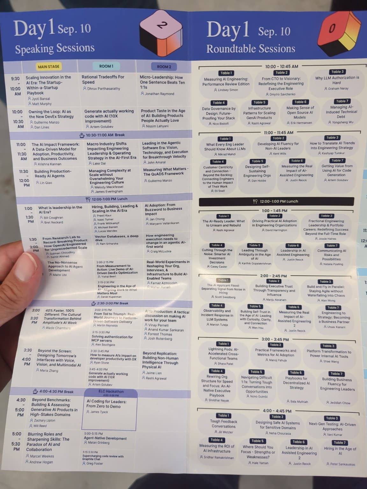
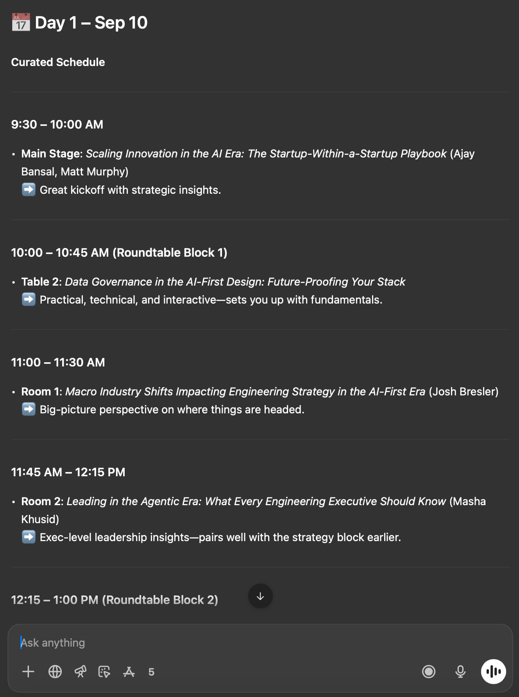
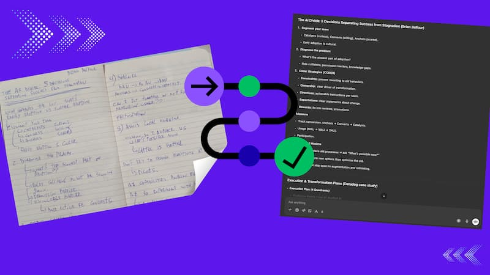
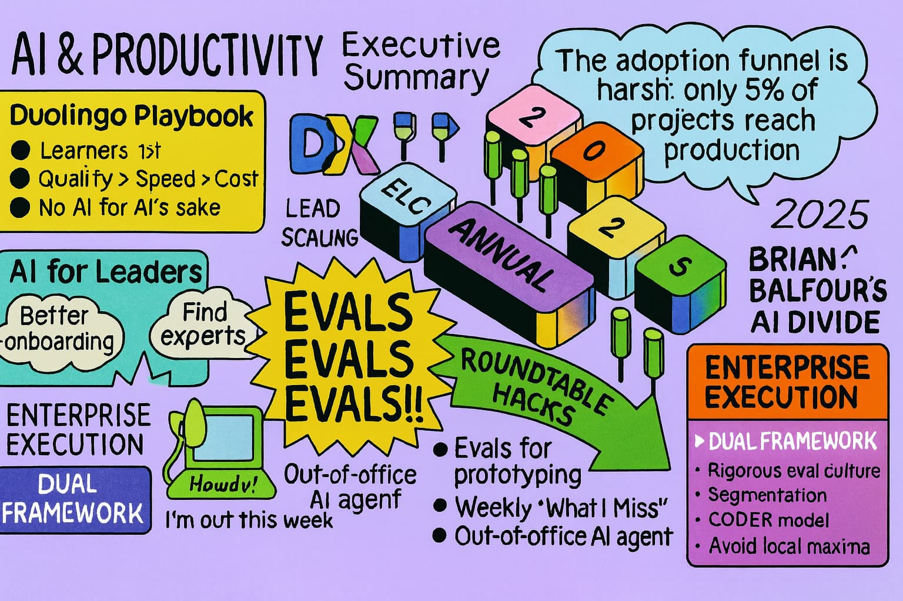

I just got back from the 2025 Engineering Leadership Conference (ELC), and this year I did something different: I brought AI with me as a conference partner.

Not on stage. Not in the expo hall. But in my workflow — before, during, and after.

⸻

### Planning with AI

Normally, conference prep means juggling agendas, deciding which talks to attend, and figuring out how to maximize hallway time. This time, I gave AI my priorities:
	•	AI in engineering leadership
	•	Developer productivity frameworks
	•	Staff+ career stories

It helped me curate a personal schedule that balanced talks, networking, and recovery time. No more FOMO. I knew where I needed to be and why.

For example, I took a photo of the schedule:

And AI made me a schedule:

⸻

### Expanding Notes in Real Time

Taking raw notes at speed is easy. Turning them into something useful is hard.

I used AI to:
	•	Summarize sessions on the fly into clean takeaways.
	•	Expand shorthand notes into readable insights.
	•	Generate visuals and sketchnotes to make concepts stick.

By the end of day one, I didn’t just have scribbles — I had polished executive summaries I could share with my team.

Taking a screenshot and converting it to text has never been easier!

And AI is becoming good at sketchnote making too:

⸻

### Why This Matters

Conferences are about ideas + connections, but most people leave with a notebook they’ll never revisit.

With AI as a thinking partner, my ELC experience felt different:
	•	More intentional (clear schedule).
	•	More impactful (notes I can actually reuse).
	•	More shareable (visuals for my team and community).

⸻

### The Bigger Picture

This wasn’t about outsourcing thinking — it was about amplifying it. AI didn’t replace my judgment; it made sure the time and money I invested in ELC had a lasting return.

That’s a preview of what I think the future of professional growth will look like: humans building relationships, AI handling the overhead.

⸻