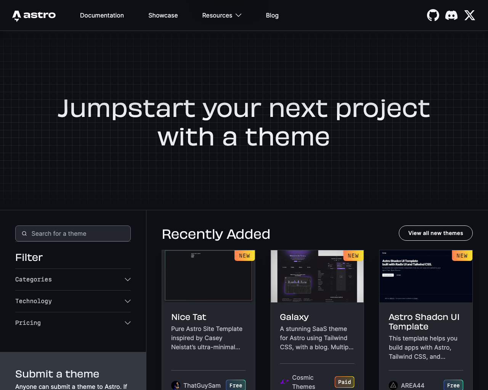
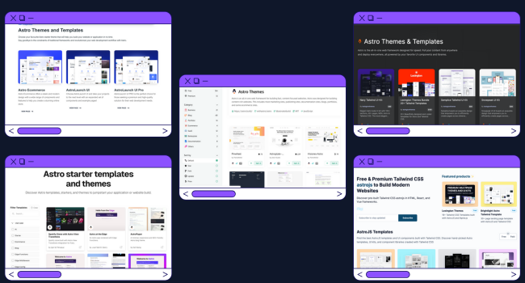
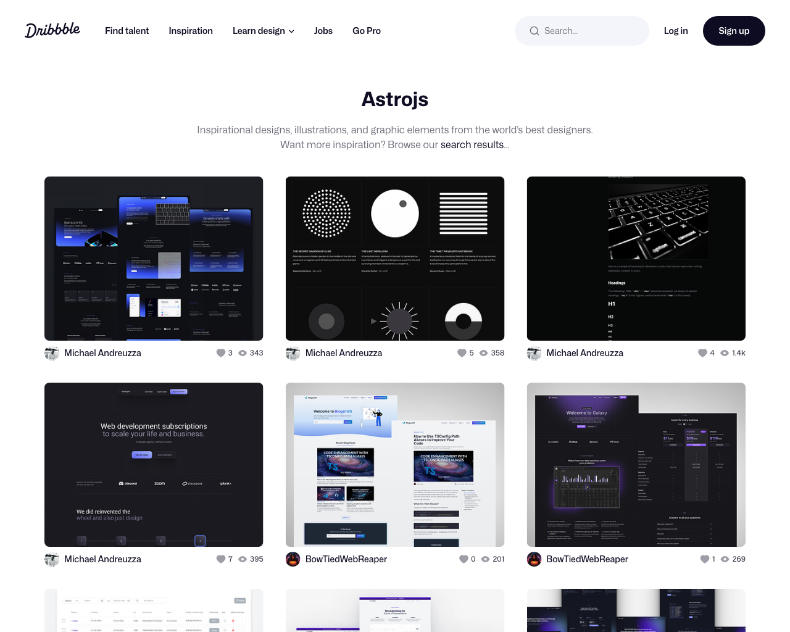
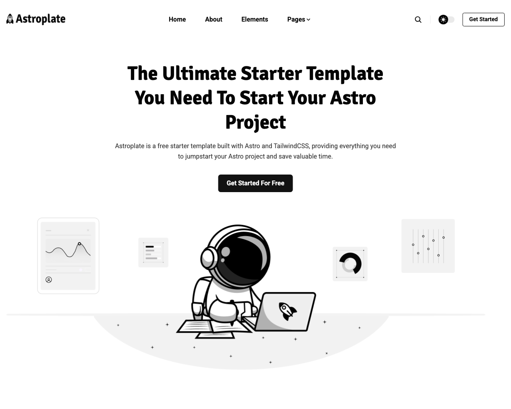
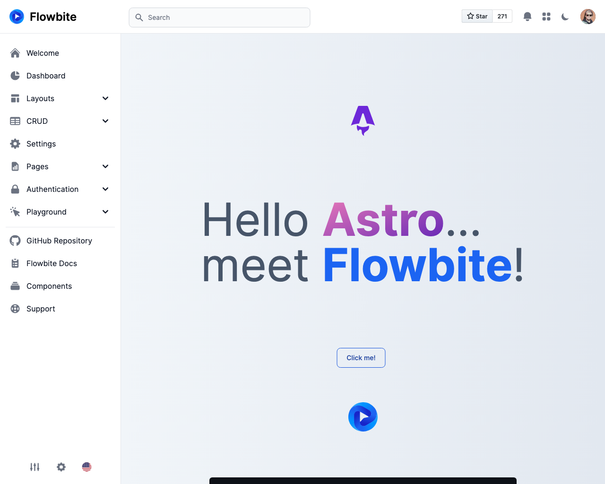

Looking for themes and templates to style your Astro site? There are lots of great places to start. Save hours of aimless searching with my handpicked collection spanning everything from beautiful pro designs to free community starting points. Consider this your Astro themes treasure trove to finally stop debating designs and start building faster!

Discover Themes For:
✅ Personal blogs
✅ Business sites
✅ Admin dashboards
✅ And way more projects!

As a developer now building my own Astro site, I created this ultimate showcase as the one-stop resource I was searching for. I think you’ll find the perfect match within this roundup to finally power up progress on your next big build!

Let's jump in exploring the different categories...

## Official Astro Themes

First stop - soak up some inspiration from the source itself! [Astro's official themes](https://astro.build/themes/) showcase features diverse designs published right on their website.

Their gallery displays everything from single page portfolios to multi-page blogs and business sites. Flaunt your Astro skill by submitting your own creation!

## Marketplaces

Ready to skill up your site with next level design? Premium sellers offer eye-catching Astro themes worth the money.

Tailor templates from top coding companies like [Vercel](https://vercel.com/templates/astro), [Creative Tim](https://www.creative-tim.com/astro/), [StaticHunt](https://statichunt.com/astro-themes), [Tailkits](https://tailkits.com/templates-kits/tags/astrojs/) and [Built at Lightspeed](https://www.builtatlightspeed.com/category/astro?themes[refinementList][categories.ssg][0]=astro). Their polished designs take visual appeal up a notch!

Part of Astro's appeal lies with its active community supporting each other. So I had to spotlight the work of fellow fans pushing possibilities:

- [CloudCannon](https://cloudcannon.com/blog/top-23-free-astro-themes-for-building-out-of-this-world-static-sites-in-2023/) curated Astro-specific galleries so you can filter quality templates in one spot.
- If you are looking for design inspiration checkout [astroJS Dribble curated list](https://dribbble.com/tags/astrojs).

- Another open source project that looks great is [Astroplate](https://github.com/zeon-studio/astroplate). It offers a lot of features for you to remix and build your own.

- Finally, check [Themeberg's open source admin dashboard](https://github.com/themesberg/flowbite-astro-admin-dashboard) for a robust Astro foundation aligned with the popular Flowbite library.

## Blast Off Building!

Start right-sizing your Astro site with a premade fit from this ultimate theme and template resource roundup!