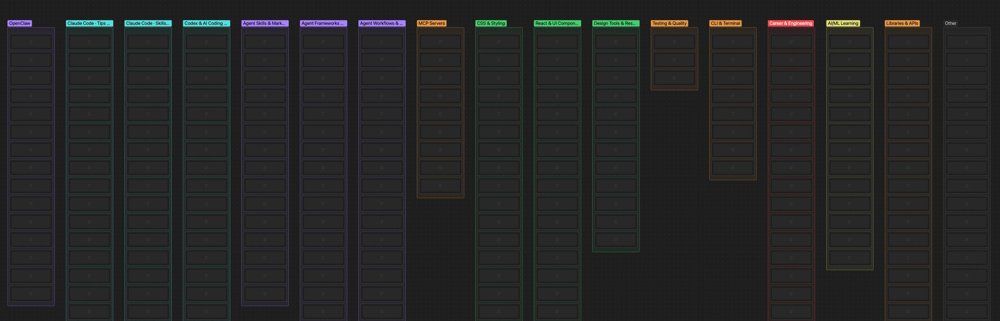
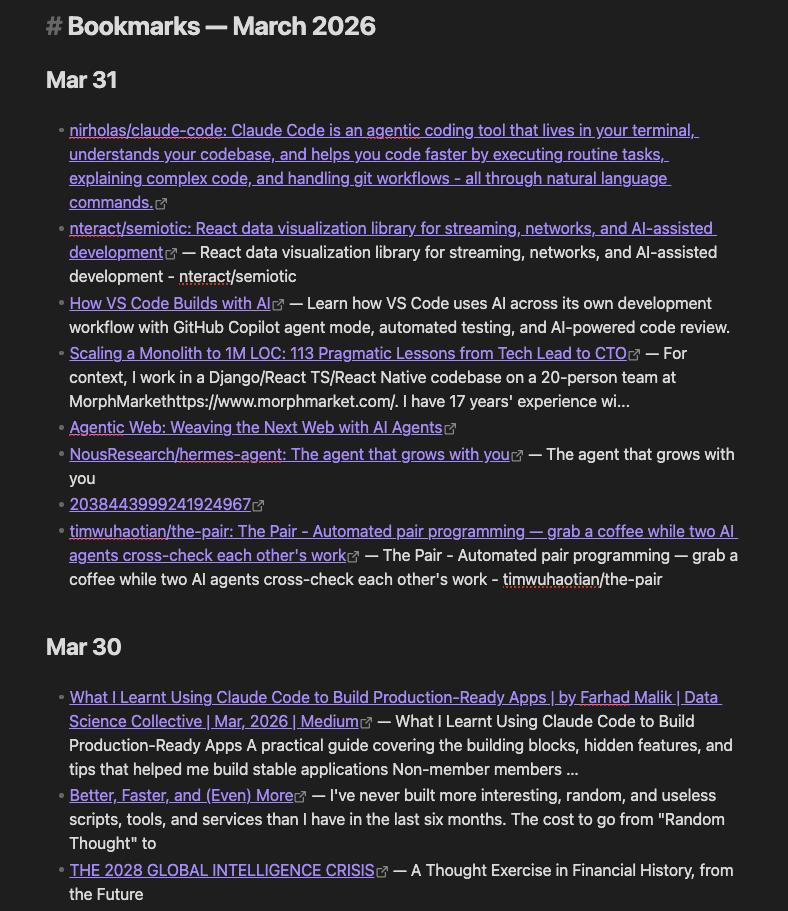

Between [Raindrop](https://raindrop.io/), [Feedly](https://feedly.com/), newsletters, and random tabs, I was doing a lot of *collecting* and not enough *using*. The pile felt like a second job. I wanted one system that could pull what I follow into the place I already think—my [Obsidian](https://obsidian.md/) vault—and give me a repeatable way to refresh, visualize, and prioritize it.

This post is about what I built: **[Claude Code](https://docs.anthropic.com/en/docs/claude-code/)** skills as small CLI-style entry points, plus **slash commands** as fixed pipelines, all talking to Markdown, JSON Canvas, and a few Node scripts in the vault.

## Skills vs commands (why both)

In Claude Code, a **skill** is a folder under `.claude/skills/<name>/` with a `SKILL.md` that includes a name and description. The model uses that description to decide when your “playbook” fits what you asked for in natural language.

A **command** lives under `.claude/commands/` and encodes a **rigid workflow**: same steps, same order, same failure policy. I use skills when I want flexibility (“refresh Feedly for this week”), and commands when I want a muscle-memory shortcut (`/sync-bookmarks`) that always does the full bookmark run.

At runtime, Claude Code still does the orchestration—interpreting the request, calling tools, and running scripts—but the vault is the source of truth: notes, and canvas files.

## Skills created

These are the building blocks I created

| Skill | What it does |
| ----- | ------------ |
| **raindrop-sync** | Pulls bookmarks from Raindrop.io into monthly Markdown files (I keep them under a `Resources` section). |
| **bookmarks-to-canvas** | Turns those bookmark notes into an **Obsidian JSON Canvas**, laid out by category. |
| **rank-bookmarks** | Reorders or scores items on the canvas using an “interest profile” so what matters floats up. |
| **playwright-cli** | Browser automation for flows that need a real session—Raindrop auth is the main one here. |
| **curate-feedly** | Aggregates RSS from a Feedly subscription list into **weekly** notes. |
| **feedly-newsletter** | Builds an HTML newsletter from the latest picks, with an option to send it via AgentMail. |

Together they cover two ingestion paths: **bookmarks** (pull → canvas → rank) and **RSS** (curate → optional newsletter).

### The loop

What I save in raindrop is content that I want to read later, I liked or picked my interest. That's the content I care about. On the other hand in feedly I follow tons of different sources and it's been really hard to catch up with it. Now that I put together this skills I have a loop that will keep me more focused. 
1. I am constantly ranking and organizing what I collected in Raindrop. 
2. I use that ranking to curate the content for feedly and convert that to a newsletter I send to myself.
3. Finally, what I like from the auto generated newsletter I'll store in raindrop, updating my scores and completing the loops.

## The implementatation

### Running on a schedule with Launchd

There are multiple ways of automating and running something on a schedule. As I am running everything locally I decided to use Launchd to schedule this as background tasks daily.

If you want to learn more about launchd check this quick tutorial: https://blog.darnell.io/automation-on-macos-with-launchctl/. Or simply ask AI to do it 😉

### Command pipeline: `/sync-bookmarks`

`/sync-bookmarks` is the conductor. It chains the bookmark skills in a fixed order:

1. **Raindrop sync** — Run `raindrop-sync` with a Playwright-backed session where needed, hit the API, normalize data (in my setup this flows through a small script layer—e.g. JSON in, scripted sync out).
2. **Resolve the month file** — Pick the correct `YYYY-MM.md` target for the current month.
3. **Bookmarks → canvas** — Run `bookmarks-to-canvas` so the month’s links become a visual map.
4. **Rank bookmarks** — Run `rank-bookmarks` so the canvas reflects priority, not just chronology.
5. **On failure** — A global step notifies me via **AgentMail** so a silent break doesn’t turn into “why is my canvas three weeks old?”

That last step matters more than it sounds. Personal automation dies when errors are invisible.

Here's an example of what the canvas and the bookmarks looks like:

## Curating Feedly

The Feedly flow is **independent** of the bookmark pipeline. It reads and writes under `Resources/Feedly/`:

- **Input:** A subscriptions list (CSV or Markdown of feed URLs).
- **Curate:** `curate-feedly` writes a **weekly** note named like `YYYY-Www.md`.
- **Newsletter:** `feedly-newsletter` reads those picks and produces **HTML email**, again with AgentMail when I want it in an inbox instead of only in the vault.

So bookmarks get a spatial view (canvas + ranking); feeds get a temporal one (week-stamped notes + optional digest).

## How it fits together

Conceptually the stack is simple:

- **You** trigger work through **natural language** (skills match intent) or a **slash command** (fixed pipeline).
- **Claude Code** (model + tools) runs the steps and invokes scripts.
- The **vault** holds resources, generated notes, and canvas JSON; **Node** (`cli.mjs` and friends) does the deterministic glue.

Skills are the modular toolkit. Commands are the scheduled-flight checklist. Everything stays inspectable as files in the vault, which is important when you want to diff, search, or undo what automation did.

## What I’d tell myself before building this

- **Auth is never “just an API key.”** Plan for Playwright (or similar) where the provider expects a real browser session.
- **Separate “flexible” from “repeatable.”** If you only have skills, you’ll re-describe the same pipeline every time; if you only have commands, you’ll fight the model for one-off tweaks.
- **Notify on failure** before you notify on success. Personal pipelines fail in boring ways—expired cookies, API limits, path changes—and email (or AgentMail) is cheap insurance.
- **Think about composability**. I decided to build this as multiple skills so I can combine and iterate in the future. More atomic skills and maybe a command or workflow to put them together feels like it'll scale much better!

## Tools I used

- [Playwright CLI and skills](https://github.com/microsoft/playwright-cli/blob/main/skills/playwright-cli/SKILL.md). Really useful for directly scraping the data from raindrop and feedly.
- [Agentmail](https://www.agentmail.to/). This app provides emails for AI agents. It's really useful to put together a quick newsletter system and also leveraging it for errors.
- Raindrop is where I keep all my saved bookmarks.
- Feedly is my RSS aggregator (I might fully move out of it once I have this workflow more polished)
- I feel Obsidian is the perfect note taking app for the AI era, as it supports MD natively and it has tons of integrations. I can easily run any LLM CLI on the vault and make changes, reorganize, etc, etc
- I am using the [Obsidian MCP skills](https://github.com/StevenStavrakis/obsidian-mcp/tree/main/src) to manipulate the canvas model they have.
- Finally using https://defuddle.md/ to get the content from this bookmarks into markdown format.

---

I’m still iterating on prompts, folder layout, and how aggressive ranking should be. If you’re sketching something similar, start with one ingestion source and one obvious output (e.g. monthly Markdown only), then add canvas and ranking once the sync is boring and reliable.
