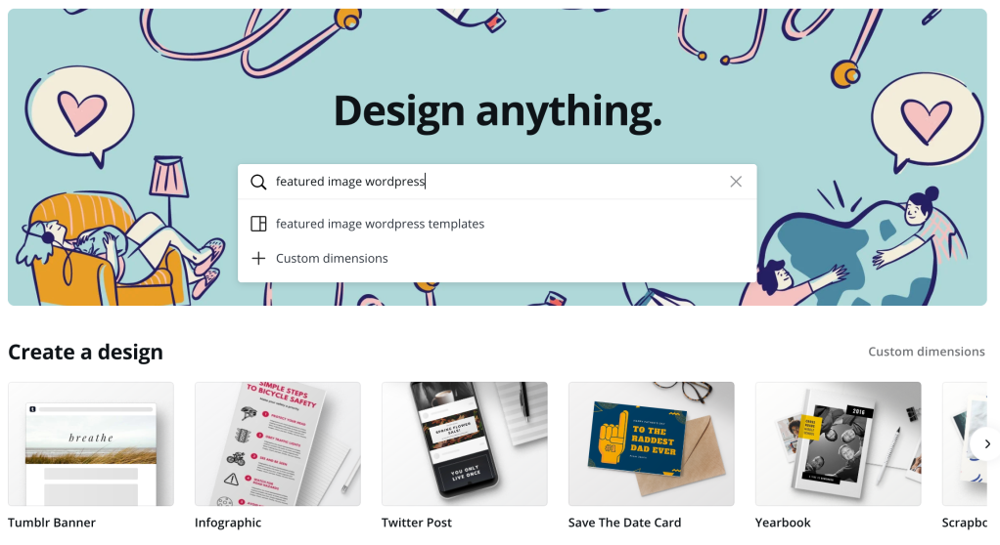
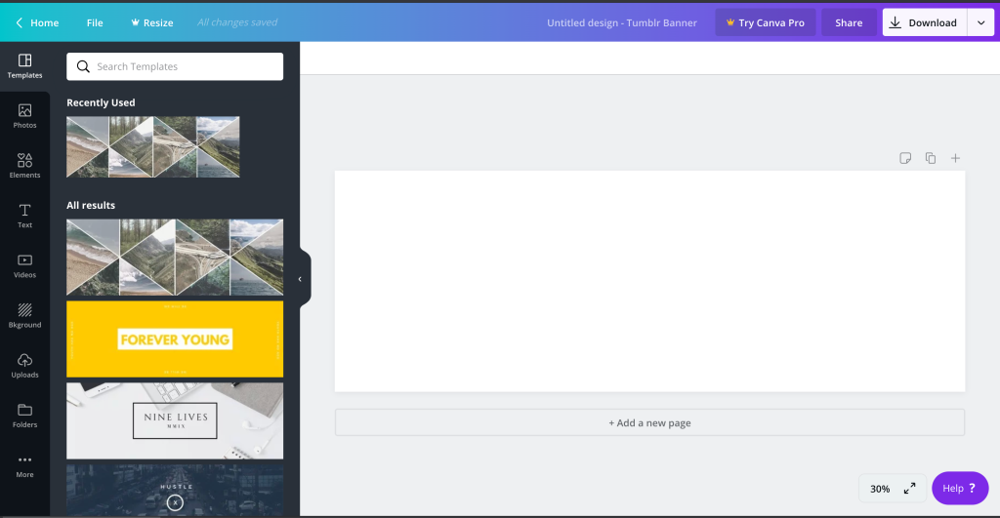
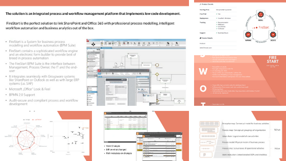
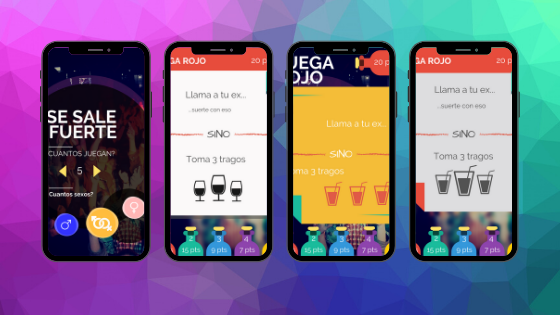
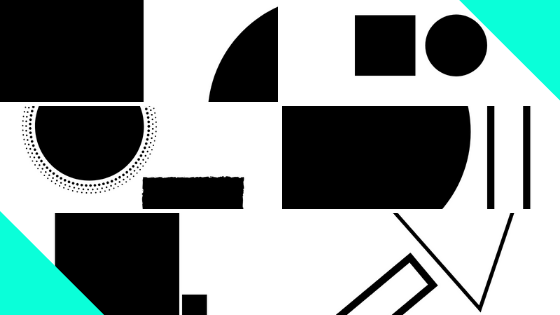

---

title: 'Create Quick and Stunning graphs'
description: ""
pubDate: 2020-04-28
tags: "art, blog, blogging, canva, design process, development, diagrams, flowchart, programming, ux, ux design, web design"
image: "../images/2020-04-canva-gallery.png"
imgAlt: "Canva.com main editor"
---
As software developers communication is a key skill. We not only communicate with code, but also we document, share and present ideas on a daily basis.

Personally I take pride in preparing documents, diagrams and presentations to share architectures, processes, designs and ideas. I sometimes tend to spend more time than needed :)

I want to share with you my favorite tool I use to help me create these assets.

## Canva.com

[Canva](https://www.canva.com/) is an online editor created to enable non visual designers to create professional looking assets in no time. It is based on a freemium model, but so far I haven't needed to use any of their paid services (and I have been using it for more than 8 years!).

#### How does it work?

After you create an account you will see a gallery of options to create a new design:

It has dimensions for most of the common formats (including a lot of social media apps) and also allows you to define custom dimensions.

When creating a new design, it will open a new tab with a full drag & drop editor

The editor comes with a palette that has multiple options:

- Templates: pick custom predefined designs for the format selected
- Photos: Frames to quickly add photos. This is one of the killer features
- Elements: Any type of elements, stickers, assets. I tend to use search a lot here
- Text: Simple text combos, it supports a lot of fonts and templates usually combine them for you.
- Videos: I haven't used videos yet, but I noticed that recently was incorporated along with the support for gifs.
- Background: Multiple background patterns and ideas.
- Uploads: You can upload your own assets and manage them here
- Folders: This is a premium feature, so I haven't tested out yet.
- More: support for other richer content like free images, youtube video connect, facebook and more.

Once your design is ready, you can download it as a png or pdf. Keep in mind that if you used any asset that is not free, you will need to pay a small amount for the royalties.

They also have a [blog](https://www.canva.com/learn/welcome-to-the-canva-blog-2/), that you can use for inspiration.

I have used this tool successfully for the following:

- Presentation covers or visuals.
- Graphs, processes, diagrams, and any other supporting assets.
- Icons, banners, even some high level mocks for apps.
- Content for my blog.
- Moodboards.

What it has not been so useful for:

- Full presentations. It is simply not as quick as any regular tool and also it can become laggy when making too many slides.
- Tables or content that has lots of text.
- Mockups or wireframes. I gave this a try a couple of times, but I tend to move to some other tool really quickly.

Some of examples of what I have created:

