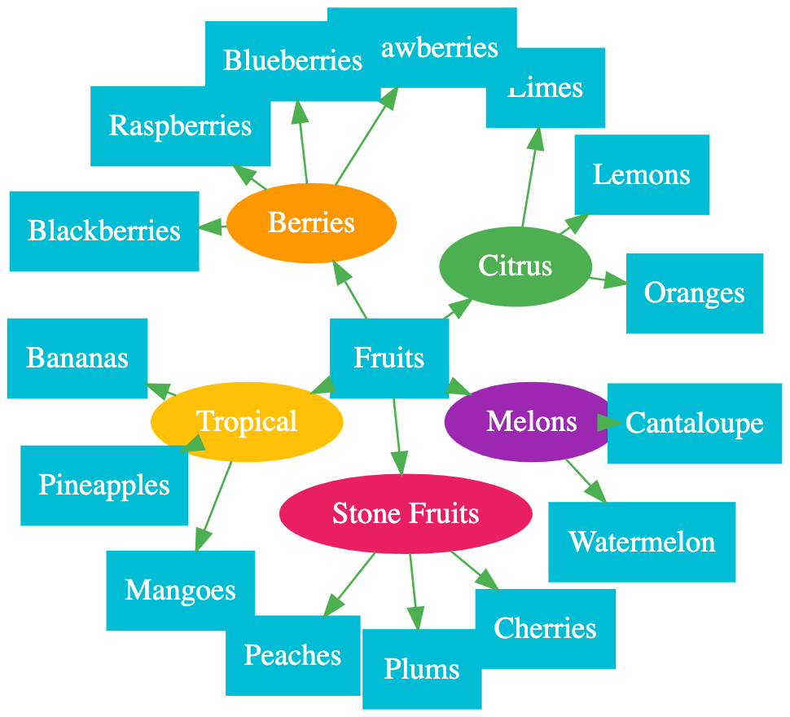
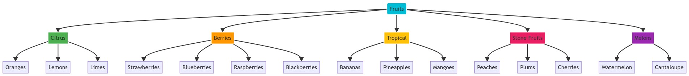

I've been experimenting with ChatGPT and discovered a cool trick that lets you create diverse graph visualizations effortlessly.

Since ChatGPT excels in text generation, you can leverage its capabilities to generate graphs using domain-specific languages (DSL). Luckily, there are open-source tools like Graphviz and MermaidJS, and the best part is that ChatGPT is well-versed in these languages.

The recommended DSLs are:

1. **Graphviz**
2. **MermaidJS**

Ask ChatGPT to convert any text into one of these DSLs, and then use online visualization tools to turn them into actual images.

Recommended tools for visualization:

1. [GraphvizOnline](https://dreampuf.github.io/GraphvizOnline/): Excellent for Graphviz
2. [Mermaid Live](https://mermaid.live/): Ideal for MermaidJS

## **Crafting a Mind Map**

Let's walk through an example. I tasked ChatGPT with creating diagrams for both DSLs based on fruits and categories as our starting point:

## Building a mind map

Let’s use an example to illustrate this. I asked chat GPT to put together a diagram on both DSLs for fruits. We use these fruits and categories as the starting point:

**Fruits**

- **Citrus**: Oranges, Lemons, Limes
- **Berries**: Strawberries, Blueberries, Raspberries, Blackberries
- **Tropical**: Bananas, Pineapples, Mangoes
- **Stone Fruits**: Peaches, Plums, Cherries
- **Melons**: Watermelon, Cantaloupe

### GraphViz

The code generated looks like this:

```jsx
digraph G {
  node [style="filled", color="#00bcd4", fontcolor="#ffffff", shape="box"];
  edge [color="#4CAF50"];

  Fruits [label="Fruits"];
  
  Citrus [label="Citrus", shape="ellipse", color="#4CAF50"];
  Berries [label="Berries", shape="ellipse", color="#ff9800"];
  Tropical [label="Tropical", shape="ellipse", color="#FFC107"];
  StoneFruits [label="Stone Fruits", shape="ellipse", color="#E91E63"];
  Melons [label="Melons", shape="ellipse", color="#9C27B0"];

  Fruits -> Citrus;
  Fruits -> Berries;
  Fruits -> Tropical;
  Fruits -> StoneFruits;
  Fruits -> Melons;

  Oranges [label="Oranges"];
  Lemons [label="Lemons"];
  Limes [label="Limes"];
  Strawberries [label="Strawberries"];
  Blueberries [label="Blueberries"];
  Raspberries [label="Raspberries"];
  Blackberries [label="Blackberries"];
  Bananas [label="Bananas"];
  Pineapples [label="Pineapples"];
  Mangoes [label="Mangoes"];
  Peaches [label="Peaches"];
  Plums [label="Plums"];
  Cherries [label="Cherries"];
  Watermelon [label="Watermelon"];
  Cantaloupe [label="Cantaloupe"];

  Citrus -> {Oranges Lemons Limes};
  Berries -> {Strawberries Blueberries Raspberries Blackberries};
  Tropical -> {Bananas Pineapples Mangoes};
  StoneFruits -> {Peaches Plums Cherries};
  Melons -> {Watermelon Cantaloupe};
}
```

And the output looks like this:



[You can check both live](https://dreampuf.github.io/GraphvizOnline/#digraph%20G%20%7B%0A%20%20node%20%5Bstyle%3D%22filled%22%2C%20color%3D%22%2300bcd4%22%2C%20fontcolor%3D%22%23ffffff%22%2C%20shape%3D%22box%22%5D%3B%0A%20%20edge%20%5Bcolor%3D%22%234CAF50%22%5D%3B%0A%0A%20%20Fruits%20%5Blabel%3D%22Fruits%22%5D%3B%0A%20%20%0A%20%20Citrus%20%5Blabel%3D%22Citrus%22%2C%20shape%3D%22ellipse%22%2C%20color%3D%22%234CAF50%22%5D%3B%0A%20%20Berries%20%5Blabel%3D%22Berries%22%2C%20shape%3D%22ellipse%22%2C%20color%3D%22%23ff9800%22%5D%3B%0A%20%20Tropical%20%5Blabel%3D%22Tropical%22%2C%20shape%3D%22ellipse%22%2C%20color%3D%22%23FFC107%22%5D%3B%0A%20%20StoneFruits%20%5Blabel%3D%22Stone%20Fruits%22%2C%20shape%3D%22ellipse%22%2C%20color%3D%22%23E91E63%22%5D%3B%0A%20%20Melons%20%5Blabel%3D%22Melons%22%2C%20shape%3D%22ellipse%22%2C%20color%3D%22%239C27B0%22%5D%3B%0A%0A%20%20Fruits%20-%3E%20Citrus%3B%0A%20%20Fruits%20-%3E%20Berries%3B%0A%20%20Fruits%20-%3E%20Tropical%3B%0A%20%20Fruits%20-%3E%20StoneFruits%3B%0A%20%20Fruits%20-%3E%20Melons%3B%0A%0A%20%20Oranges%20%5Blabel%3D%22Oranges%22%5D%3B%0A%20%20Lemons%20%5Blabel%3D%22Lemons%22%5D%3B%0A%20%20Limes%20%5Blabel%3D%22Limes%22%5D%3B%0A%20%20Strawberries%20%5Blabel%3D%22Strawberries%22%5D%3B%0A%20%20Blueberries%20%5Blabel%3D%22Blueberries%22%5D%3B%0A%20%20Raspberries%20%5Blabel%3D%22Raspberries%22%5D%3B%0A%20%20Blackberries%20%5Blabel%3D%22Blackberries%22%5D%3B%0A%20%20Bananas%20%5Blabel%3D%22Bananas%22%5D%3B%0A%20%20Pineapples%20%5Blabel%3D%22Pineapples%22%5D%3B%0A%20%20Mangoes%20%5Blabel%3D%22Mangoes%22%5D%3B%0A%20%20Peaches%20%5Blabel%3D%22Peaches%22%5D%3B%0A%20%20Plums%20%5Blabel%3D%22Plums%22%5D%3B%0A%20%20Cherries%20%5Blabel%3D%22Cherries%22%5D%3B%0A%20%20Watermelon%20%5Blabel%3D%22Watermelon%22%5D%3B%0A%20%20Cantaloupe%20%5Blabel%3D%22Cantaloupe%22%5D%3B%0A%0A%20%20Citrus%20-%3E%20%7BOranges%20Lemons%20Limes%7D%3B%0A%20%20Berries%20-%3E%20%7BStrawberries%20Blueberries%20Raspberries%20Blackberries%7D%3B%0A%20%20Tropical%20-%3E%20%7BBananas%20Pineapples%20Mangoes%7D%3B%0A%20%20StoneFruits%20-%3E%20%7BPeaches%20Plums%20Cherries%7D%3B%0A%20%20Melons%20-%3E%20%7BWatermelon%20Cantaloupe%7D%3B%0A%7D%0A)

### MermaidJS

The code on Mermaid looks like this:

```jsx
graph TB
  A(Fruits)
  B[Citrus]
  C[Berries]
  D[Tropical]
  E[Stone Fruits]
  F[Melons]

  G[Oranges]
  H[Lemons]
  I[Limes]

  J[Strawberries]
  K[Blueberries]
  L[Raspberries]
  M[Blackberries]

  N[Bananas]
  O[Pineapples]
  P[Mangoes]

  Q[Peaches]
  R[Plums]
  S[Cherries]

  T[Watermelon]
  U[Cantaloupe]

  A --> B
  A --> C
  A --> D
  A --> E
  A --> F

  B --> G
  B --> H
  B --> I

  C --> J
  C --> K
  C --> L
  C --> M

  D --> N
  D --> O
  D --> P

  E --> Q
  E --> R
  E --> S

  F --> T
  F --> U

style A fill:#00bcd4,stroke:#fff,stroke-width:2px
style B fill:#4CAF50,stroke:#fff,stroke-width:2px
style C fill:#ff9800,stroke:#fff,stroke-width:2px
style D fill:#FFC107,stroke:#fff,stroke-width:2px
style E fill:#E91E63,stroke:#fff,stroke-width:2px
style F fill:#9C27B0,stroke:#fff,stroke-width:2px
```

And the image: 



[You can check both live here](https://mermaid.live/edit#pako:eNqNlFuPojAAhf8K6bzMJmhAEC0PmwjC3HR01MkmW_ehA2Vs5JZSMuMY__sWilvnZSO8fOf0nFII7RFERUyAC94ZLnfaxtvmmja5DVlNefWjER7yKWd19acRPvIIY5RINUUbVpQ0wmkrA7TmRU40WW6tEM1JWuSNaOQdWjCcv3f1ezQjmRzUtAc0oxk5Bx_FVAx_vF087Al5aU0unRla4aq8dOYig6O9shrzGXk4F7eMLNCS5gSXZdp1lmgullT8i7-gJcHRrhtdoWVaZ5LXyN99m3mDfmFOWNa8Ypt4RT7OOU6LuiRdZqL1ej81T6GvcKowUBjKoteKO4X3Ch9kxG_Fo8InhTOFc5metuJZ4ULhUkaCVrwoXClcy0jYio3C18av-CElYv0JTVP3xjDeotjWK86KPXFvkiTpuPdBY75zB-XnueJ1FdufhEPjqorfVZIEjo3rKtOuEoa-aYyuqgRdJYBm4FhXVcKuAv3ByPv_woAOMvHjYBqLrXdsPuYW8B3JyBa4AmPM9luwzU8ih2terA95BFyxC4kO6jIWP92UYrFjM-AmOK2EW-L8d1Fk55CQwD2CT-BC2B-ZgxG0LDiyHcvSwQG4pm33oW2ZDrSdwXA8dpyTDr7avtG3obyGYzg2ITQdHZCY8oLN5UnRHhinv-YVU7g)

## **Conclusion**

The possibilities are endless with this powerful combo. Utilize it to transform your ChatGPT conversations into captivating visualizations.

I trust you found this nifty trick intriguing. Feel free to share your creations with me on X. Let's visualize the world of ChatGPT together! 🚀