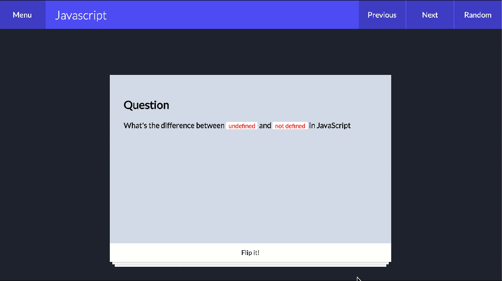

---

title: 'Creating gifs from the OSX terminal in 2 easy steps'
description: ""
pubDate: 2020-03-31
tags: "create gif, demo, design, develop, development, gif, movie to gif, osx terminal, presentation, ui ux, ux, ux design, ux designer"
image: "../images/defaultHero.jpg"
imgAlt: ""
---
I like sharing quick demos to all the stakeholders as soon as I start developing something new. I find that sharing soon helps to get early feedback and make sure that everyone's requirements are covered.

But sometimes it is hard to find out the proper format to share. If I share only an image, then all the interaction is lost. Or if I share a video, then depending on the format some users might not be able to open it (and is also usually big in size).

After trying a few different formats I found that gifs are the best way of sharing quick demos. I follow a 2 step approach to it:

1. I record the screen using Quick Time.
2. I convert this CLI I found online called [screengif](https://github.com/dergachev/screengif).

Here is an example of the outcome:



## Installing screengif

As the readme states, installing with brew is super easy:

```bash
# x-quartz is a dependency for gifsicle, no longer installed starting on 10.8
brew cask install xquartz
brew install ffmpeg imagemagick@6 gifsicle pkg-config
sudo gem install screengif
```

After installing, you can convert a video to a gif using the following command:

```bash
screengif --input [file.mov] --output [file.gif]
```

## How does screengif work?

This package wraps a couple of libraries that do the following: 1. Exports video frames into images (`ffmpeg` package). 2. Takes those images and creates a gif out of it (`gifsicle` package).

So, you could achieve the same outcome by installing these packages independently:

```bash 
brew install ffmpeg
brew cask install xquartz
brew install gifsicle
```

And finally create the gif with the following command:

```bash
ffmpeg -i [file.mov] -s 600x400 -pix_fmt rgb24 -r 10 -f gif - | gifsicle --optimize=3 --delay=3 > [file.gif]
```

Check [ffmpeg](https://ffmpeg.org/ffmpeg.html) and [gifsicle](https://www.lcdf.org/gifsicle/) documentation for more information on what parameters are supported.

First seen in this [gist](https://gist.github.com/dergachev/4627207)

Enjoy!!
