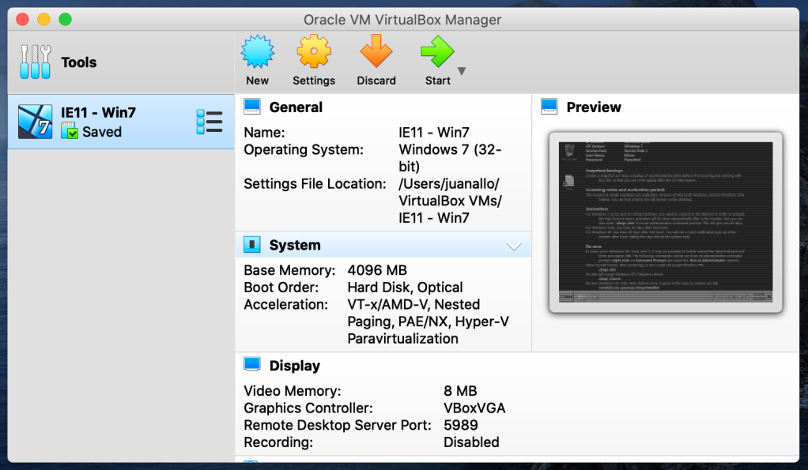
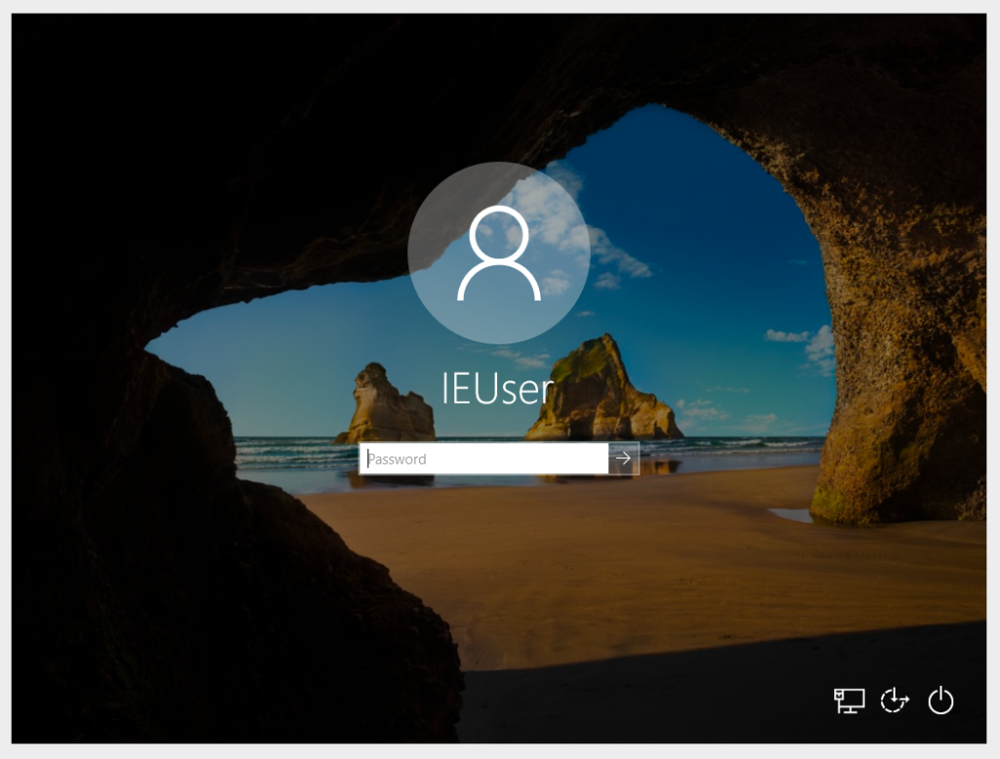
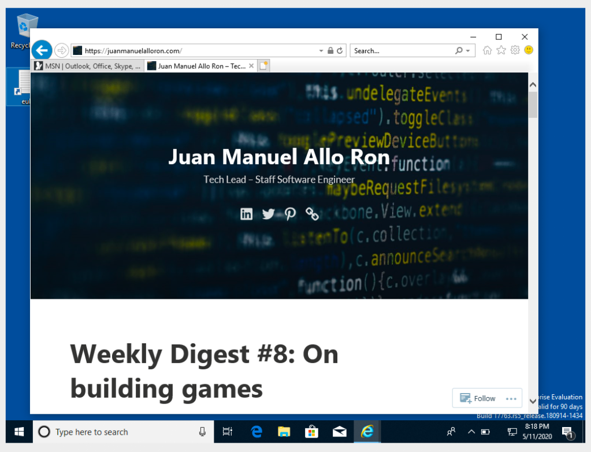
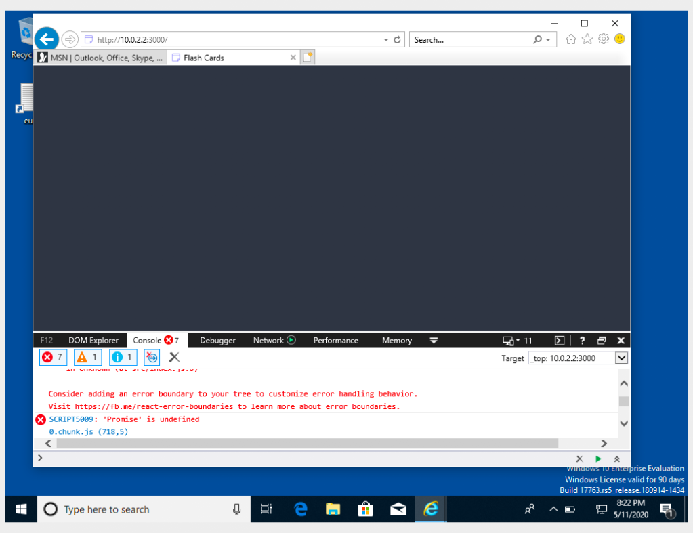

---

title: 'Debugging IE11 with VirtualBox'
description: "A quick setup with virtualbox to test IE11"
pubDate: 2020-05-12
tags: "coding, debug, debugging, development, javascript, virtualBox"
image: "../images/2020-05-virtualbox.png"
imgAlt: "VirtualBox UI screenshot"
---
IE11 is still alive and a lot of us have to maintain support for it in our web apps. There are 2 things I never like about issues in IE:

1. It is hard to setup an environment.
2. The dev tools are not as friendly!

I don't have a solution for item #2 but today I will share how I use VirtualBox to always have a setup available! It removes the friction and helps with my predisposition to fix this edge _(no pun intended)_ cases.

## Install VirtualBox

VirtualBox is a virtualizer that will let us run windows in any machine. You can learn more about it in their [manual](https://www.virtualbox.org/manual/ch01.html).

Depending on your OS you will need to follow different steps to install it, just go to [Downloads](https://www.virtualbox.org/wiki/Downloads) and follow those steps.

Once installed, open virtual box and you should see an interface like this:

VirtualBox main Screen

## Get Windows Images

Windows supports virtual machines (VMs) for different OS and Browser versions. Download them from the [official Windows VM list](https://developer.microsoft.com/en-us/microsoft-edge/tools/vms/).

To open the VM, unzip the package and open the `.ovf` file. This should open VirtualBox and show the installed VM.

Now click on the VM and a new window should boot Windows.

Windows VM

A couple of important notes:

- The VM expires after 90 days, so you should save a [Snapshot](https://www.howtogeek.com/150258/how-to-save-time-by-using-snapshots-in-virtualbox/) using VirtualBox to refresh it back to the original after expired.
- The default password is: `Passw0rd!`

## Run IE11 and have a blast :P

You are ready to run IE11 and debug your issues away.

## Using a Bridge for local dev

If you are working on a local repository and have a server running on `localhost` you can access that from the VM!

In IE by using `http://10.0.2.2/` you will be accessing your host machine `localhost` address. NOTE: remember to add `http://` for urls when typing to avoid going to our friend Bing!.

Website with IE11 bug 😛

If this does not work out of the box, you might need to add the mapping in Windows host file.

1. Open `C:\Windows\System32\drivers\etc\hosts` with any editor.
2. Add `10.0.2.2 localhost`

## A common gotcha

When doing the local setup make sure that there are no references of `localhost` files in your `html`. If so, IE11 will try to fetch them from `127.0.0.1` instead of `10.0.2.2` resulting in a `404`.

You might need to use a production build or manually change the URL to point to `10.0.2.2`

Enjoy!!
