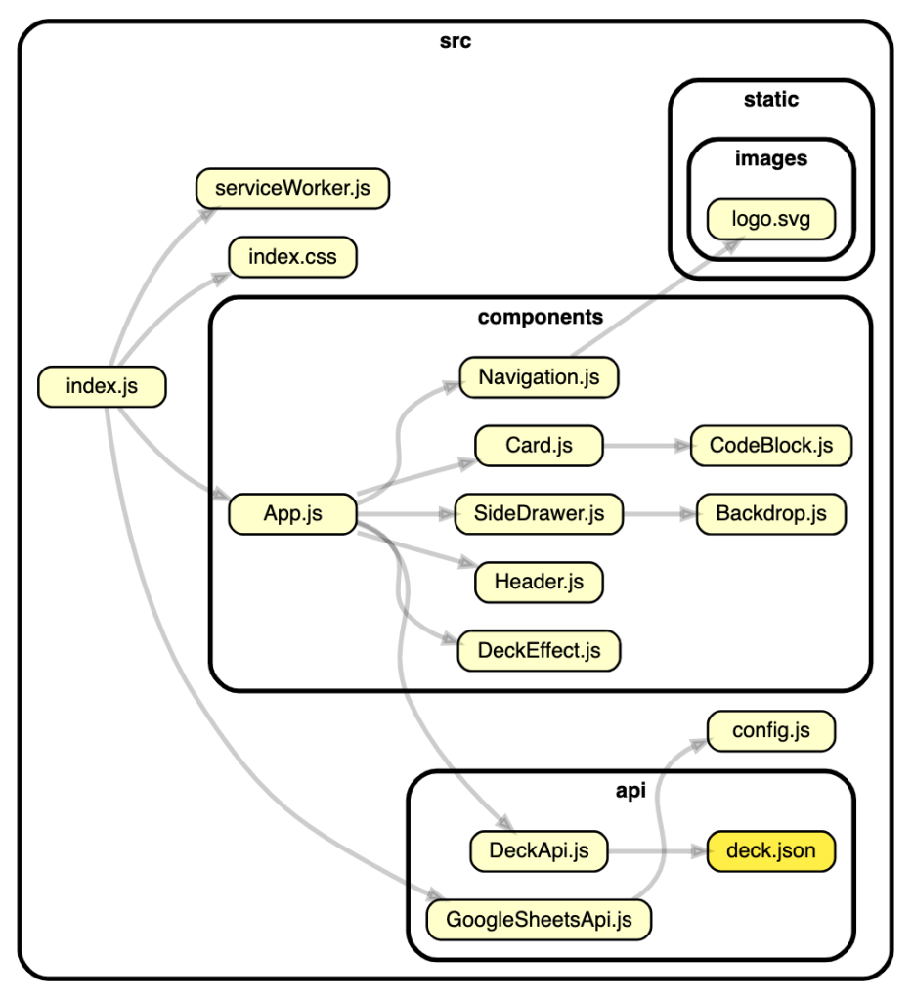

I was reading this [Javascript development setup](https://medium.com/javascript-scene/setting-up-a-new-macbook-for-javascript-development-289df3f8f9) post by Eric Elliot, when I stumbled upon a super cool NPM package to generate dependency graphs. The name is [dependency-cruiser](https://www.npmjs.com/package/dependency-cruiser).

Let me show you how to install it and run it!!

## What's a dependency graph?

It is a map of dependencies between objects. So, it will let you identify which modules/libraries depend on which. You could use this to:

- Identify where npm packages are being used
- Understand how classes/modules depend on each other
- Have a high level picture of your code
- Help you understand better other developer's code
- Refactor!!!

## Installing dependency cruiser

This package has a dependency on [graphviz](https://www.graphviz.org/), an open source graph generation software. Let's install that first

```bash
brew install graphviz
```

Now let's install dependency-cruiser globally

```bash
npm i -g dependency-cruiser
```

```bash
yarn global add dependency-cruiser
```

## Using dependency-cruiser

You can easily run this by following this command

```bash
depcruise --include-only "^src" --output-type dot src | dot -T svg > dependencygraph.svg
```

And the outcome will look something like the following:



[Example from react flash cards](https://github.com/juanallo/react-flashcards)

### Command explained

```bash
depcruise --include-only "^src" --output-type dot src
```

We are asking depedency cruiser to analyze only src folder (and all its content) and generate the output in a dot format

```bash
dot -T svg > dependencygraph.svg
```

We are taking that output and generating a visualization for it with `graphviz`

---

Looking forward to try this on bigger projects.

Enjoy!!
