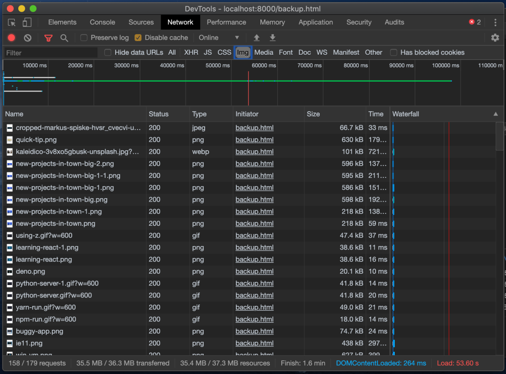
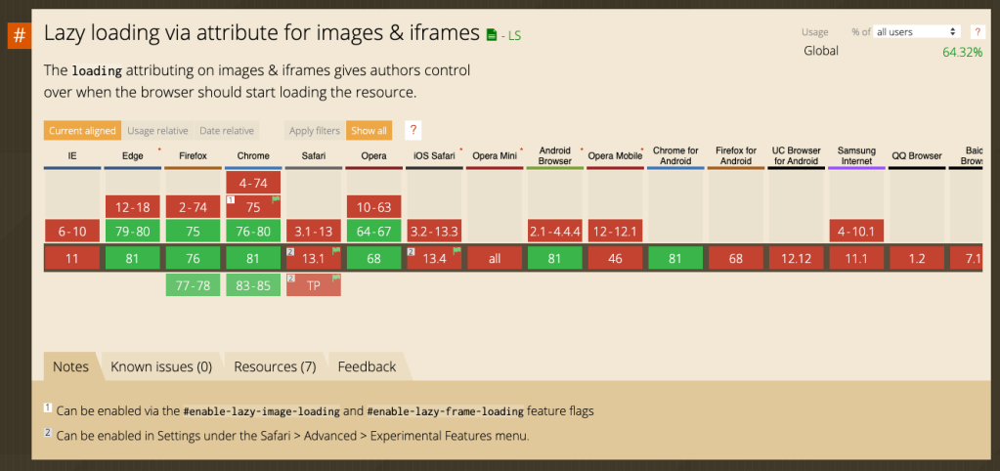
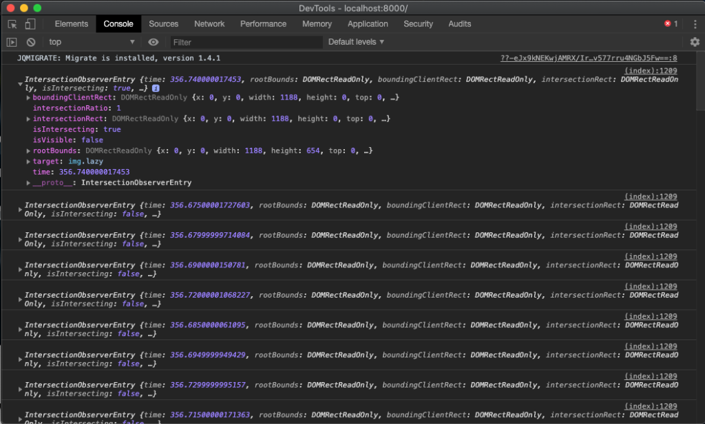
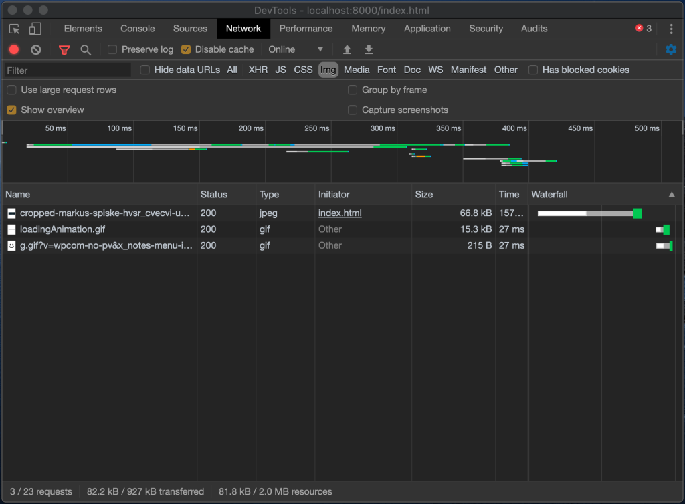
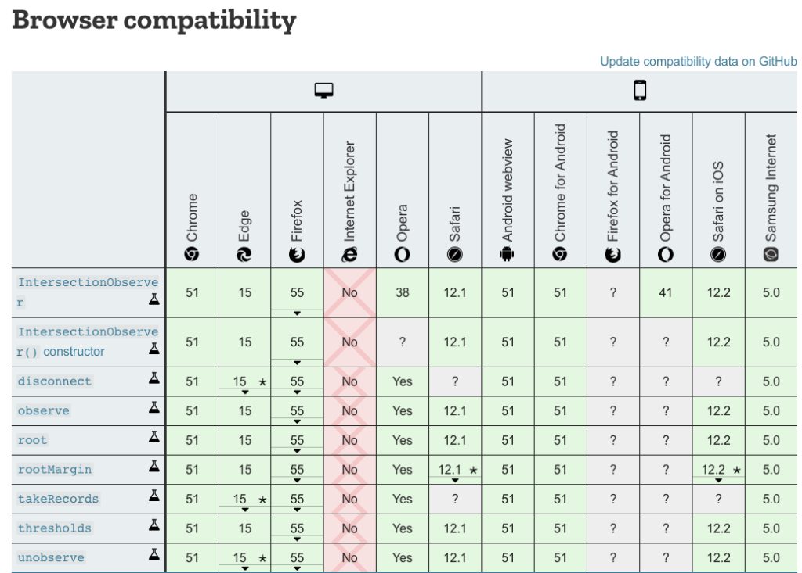

---

title: 'Lazy loading images with Intersection Observer'
description: ""
pubDate: 2020-05-26
redirect_from: 
            - http://juanmanuelalloron.com/2020/05/26/lazy-loading-images-with-intersection-observer/
tags: "development, javascript, js, lazy loading, performance, techniques, vanilla JavaScript"
image: "../images/2020-05-image-gallery-example.png"
imgAlt: "Image Slideshow example"
---
Images play a huge role in loading performance. Websites loading tons of images upfront can be paying a high price in terms of user experience. Based on [google's research](https://developers.google.com/web/fundamentals/performance/why-performance-matters) 53% of mobile users abandon a site if it does not load in 3 seconds.

To avoid this issue, I am going to show you how to implement lazy loading in only a few lines of code!

## The Example

To show an example of how this can be problematic, I created a quick gallery with all the images from my blog (around 73). Also, as you can see my blog has a big hero image. Here is the example:


And here are the network requests for the images:



There are more than 30 Mb of images downloaded and it took 53.60 seconds to finish loading all of them. Also only 7 images are seen above the fold.

## The Problem

As I mentioned in the introduction, the slowest the site the less likely users will wait or continue using it. Unfortunately there is no hiding, if you want to be faster you need to have a smaller footprint!

One more things to consider is that mobile browsing is the new norm and we need to be even more cautious. A lot of our users will be using their phone data plans while on the go, and we could be draining their plans :(

## The solution

To fix the image problem a simple strategy is to only load what's above the fold (what the users can see first) and then keep on loading on demand while they scroll down. Let me walk you trough that strategy.

### Using browser APIs

There is a new property that was recently added to the [html spec](https://github.com/whatwg/html/pull/3752/files). It allows browser to manage lazy loading for us!!! The property is called `loading` and currently supports 3 values:

- Lazy: don't load the image until visible.
- eager: load it right away.
- auto: let the browser decide when to load it.

So this seems to be the easiest solution!....but (as always) this is a new property and the browser compatibility is not the best.



[Can I use loading lazy](https://caniuse.com/#feat=loading-lazy-attr)

But not everything is lost, we can make the same happen with a few lines of code.

### Intersection Observer to the rescue

[Intersection Observer](https://developer.mozilla.org/en-US/docs/Web/API/Intersection_Observer_API) is another new API that allows us to listen for changes in DOM element visibility (In theory intersection between objects, but we will use it to intersect with the viewport)

Easier to show with code:

```js
const observe = (entries, observer) => {
    entries.forEach(entry => {
        console.log(entry)
    })
}

const observer = new IntersectionObserver(observe, {})
const images = document.querySelectorAll('img.lazy')
images.forEach(img => {
    observer.observe(img)
})
```

- The `IntersectionObserver` receives a callback (along with other options).
- In the callback we are just logging the entry.
- Then we are querying for all the images that have a `lazy` className and we will observe them.

Now, when we load the page and scroll we will see how the images are logged in the console:



We can leverage this callback to do lazy load the images!

- First we are **not** going serve the image with the proper src or srcset at load time.
- Instead we will add a `data-src` and a `data-srcset` pointing to the image URL
- We will add the `IntersectionObserver` after the page is loaded (in a `<script>` at the bottom of the `<body>`).
- The `IntersectionObserver` will use the `data-src` and `data-srcset` and inject the `src` and `srcset`.
- After this the browser will immediately request the visible images and those will be displayed. As the user scrolls new images become visible and will be loaded.

Let's talk code:

```html
<!-- this is what the image should look like -->
<!-- src is a required property, so we are just specifying empty -->
src="data:,"</code> data-src="example.png" />

<!-- if you are using srcset it will look like this: -->


<!-- this code should be at the bottom -->
<script>
    const observe = (entries, observer) => {
        entries.forEach(entry => {
            if(entry.isIntersecting) {
                const img = entry.target
                const src = img.dataset.src
                const srcset = img.dataset.srcset
                requestIdleCallback(() => {
                    if(srcset) {
                        img.srcset = srcset
                    }
                    img.src = src
                })
                observer.unobserve(img) //clean after load
            }
        })
    }

    const observer = new IntersectionObserver(observe, {})
    const images = document.querySelectorAll('img.lazy')
    images.forEach(img => {
        observer.observe(img)
    })
</script>
```

why `requestIdleCallback`? Basically we don't want to block the browser when executing this, we want it to do it when there is idle time (as we don't want to block any other loading tasks). If you want to learn more about requestIdleCallback check the [documentation](https://developer.mozilla.org/en-US/docs/Web/API/Window/requestIdleCallback).

### The Results

After making these changes, let's reload the page and see the results:



We have drastically reduced the amount of requests and improved the performance!!!

So...should we call it a day? Well, it depends, if you still need to support IE11, then you need to know that `IntersectionObserver` is not supported!



### Our friend IE11

There are 2 ways to solve this problem:

1. Use a [polyfill](https://github.com/w3c/IntersectionObserver) for the `IntersectionObserver`
2. Use a feature detection strategy and a fallback.

Today I am going to focus on the latter.

### Feature Detection

Essentially, we are going to check to see if `window.IntersectionObserver` exists before we execute our code. If it does not exist, then we will use the following fallback:

- Select all the lazy images
- Replace `data-src` and `data-srcset` with `src` / `srcset` even when they are not visible.

```html
<script>
    if(window.IntersectionObserver){
         const observe = function (<em>entries</em>, <em>observer</em>) {
             <em>entries</em>.forEach(function(<em>entry</em>) {
                 if(<em>entry</em>.isIntersecting) {
                     const img = <em>entry</em>.target
                     const src = img.dataset.src
                     const srcset = img.dataset.srcset

                     requestIdleCallback(function () {
                         if(srcset) {
                            img.srcset = srcset
                         }
                         img.src = src
                     })
                     <em>observer</em>.unobserve(img)
                  }
             })
        }

        const observer = new IntersectionObserver(observe, {})
        const images = document.querySelectorAll('img.lazy')
        images.forEach(function(<em>img</em>) {
            observer.observe(<em>img</em>)
        })
    }
    else {
        const images = document.querySelectorAll('img.lazy')
        for(let i=0 ; i < images.length; i++){
            const img = images[i]
            const src = img.dataset.src
            const srcset = img.dataset.srcset

            if(srcset) {
                img.srcset = srcset
            }
            img.src = src
        }
    }
</script>
```

As you noticed I also made a few more changes to the script: no arrow functions and no forEach. I did this to provide full support on IE11 (Usually tools like Babel do this for me!)

Also, you might be thinking that this script can be decomposed into some functions and I agree! I just wanted to keep it simple to explain the concepts, I leave the refactor to you!!!

Let's see this working in IE11:


How did I run IE11? Check my post: [how to run IE11 with VirtualBox.](https://juanmanuelalloron.com/2020/05/12/debugging-ie11-with-virtualbox/#more-679)

### More Improvements

There is always room for improvements. Here are some ideas:

- Skeleton UI: While the image is loading, you might want to have a skeleton UI or at least use proper dimensions (to avoid content shift)
- IntersectionObserver options: The Observer has some options you can leverage to trigger the load. For example it has an intersection ratio.
- Blurred images: If your image provider supports masks, consider using a blurred image for the initial load. It will always be better than a shimmer and blurred images size should be small.

---

It used to be hyper complicated to do something like this 5 years ago. With the pace the web is evolving, it will be as easy as doing `loading="lazy"` in a near future, but in the meantime I hope you can leverage the technique I explained in this article.

If you want to check the final code you can open this [Github Gist](https://gist.github.com/juanallo/9420b04973440742ab68d1fbd574aaf7)

Enjoy!!
