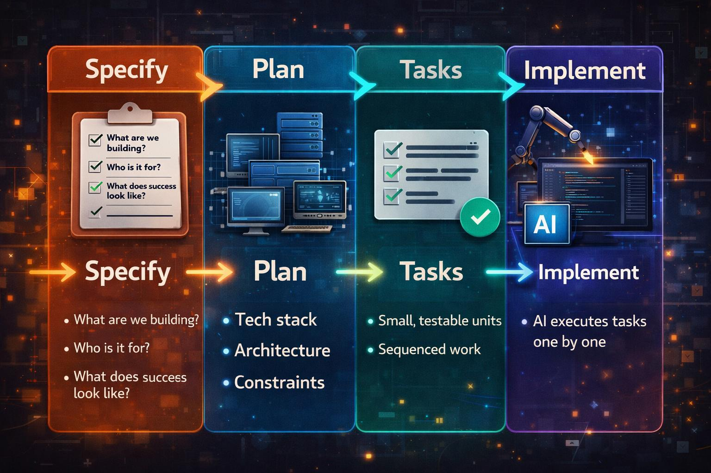

Now that AI can produce massive amounts of code way faster, we need to reduce ambiguity about what we want to build. Tools like GitHub’s [Spec Kit](https://github.com/github/spec-kit) revolve around that idea. This post is mainly for people who are already vibe coding with AI agents, have heard of specs, and wonder whether Spec Kit is worth the overhead—here’s what I learned.

The through-line for me is not the brand of the toolkit: **design clarity, model choice (and cost), and a real validation loop** are what separate useful output from pretty diffs. Spec Kit was the experiment; those three are the lesson.

## What is Spec Kit?

Spec Kit is GitHub’s official open-source toolkit for “spec-driven development” with AI.

In plain English:

> It’s built to push you toward defining what you want clearly first, so AI can build toward that instead of guessing.

The workflow is convention, prompts, and structure—the toolkit **nudges** you through steps; staying in order and keeping quality high is still **you and the agent**. The workflow looks like this: Spec → Plan → Tasks → Code.

The spec becomes the source of truth for everything that follows.

This is the backbone:

1. Specify
	-	What are we building?
	-	Who is it for?
	-	What does success look like?

2. Plan
	-	Tech stack
	-	Architecture
	-	Constraints

3. Tasks
	-	Small, testable units
	-	Sequenced work

4. Implement
	-	AI executes tasks one by one (in my run, I didn’t use parallelization). You could try a [Ralph loop](https://awesomeclaude.ai/ralph-wiggum) to parallelize

## Key Learnings

### 1. You need a design (for graphical UIs)

I wanted to try Spec Kit, so I started a small system to track sessions and tasks across multiple AI tools. I had **a working prototype in about two hours**. The stepwise flow was great, but without a design up front, the UI and overall experience were way off.

**In my ideal workflow**, I’d insert a step right after Specify: take the spec and produce a concrete **visual** design and experience before Plan/Tasks. Tools like [pencil.dev](https://pencil.dev) (which I’ve been experimenting with) or [paper.design](https://paper.design/) could sit there. I still want to explore alternatives, but the pattern is clear.

Are you building a **CLI**? You may not need **visual mockup files**, but you still need **UX** clarity—flows, errors, help, and pacing. Libraries like [Ink](https://github.com/vadimdemedes/ink) help with implementation, not with skipping that thinking.

What I’d do next time: **remove ambiguity in the spec**, then add at least a rough wireframe or screen list before heavy implementation—even a bad sketch beats none.

### 2. Credits and models

Premium “thinking” models burn budget fast when you use them for Specify, planning, and implementation end to end. In my case that meant **burning through my Cursor quota** while leaning on Opus for quality; your product names will differ, but the pattern is the same.

A strong model (e.g. GPT-4 or Opus—or whatever is the latest tomorrow :P) pays off for the early steps: Specify, design thinking, and Plan. For **breaking down tasks and churning implementation**, cheaper or faster models are usually enough. If you use Cursor, Composer is a reasonable fit for that tail—**the rule is tool-agnostic**: match model strength (and cost) to the step.

What I’d do next time: **plan quota**, mix models by phase, and avoid using the heaviest model for every task.

### 3. Give the agent a way to validate its work

GIVE AI A WAY TO VALIDATE ITS WORK. Everything is moving toward agents that don’t just write code but **run checks**. In practice I want **agents running tests** in the loop (with TDD or tight test contracts), not only “code that looks right.”

- I’ve had good results with Matt Pocock’s TDD skill: https://github.com/mattpocock/skills/tree/main/tdd  
- For UI, tools like pencil.dev can support visual workflows; for browser checks, **Playwright** is the other half—whether via [Playwright MCP](https://github.com/microsoft/playwright-mcp), an agent skill, or the **CLI** in CI. Same idea, different wiring.

What I’d do next time: **keep tasks small and test-shaped**, rerun Specify/Plan when reality diverges, and stay in the loop for QA, domain judgment, and design taste—automation doesn’t replace that.

## Quick Reference

- **Spec:** The more you remove ambiguity up front, the less the model invents.  
- **Tasks:** Granular, sequenced units beat one giant “build the app” task.  
- **Iterate:** Expect to tweak the spec, re-read the plan, and rerun tasks.  
- **Usage:** Track spend; reserve the expensive model for reasoning-heavy steps.  
- **Human:** Manual QA and product context still matter for anything you’d ship.

## Conclusion

I’m **on board with spec-driven development**: clear intent, plans, and tasks beat pure improvisation for anything non-trivial. I’m **not committing to Spec Kit as my daily default**. It was a useful experiment, and I’m happy to borrow the discipline while mixing other tools and workflows.

There are tons of people attacking this problem with different angles. My approach is to try what sounds useful, keep what fits, and **personalize**: learn several structured workflows and use AI to blend one that matches how you work. Keep iterating as you go.

If you want more on how I compare tools and workflows, follow the blog. I’ll keep writing as I try new ones.

## Resources

- [Martin Fowler — Exploring spec-driven development tools](https://martinfowler.com/articles/exploring-gen-ai/sdd-3-tools.html) — Conceptual tour of spec-driven AI workflows and how different tools compare.  
- [github/spec-kit](https://github.com/github/spec-kit) — Upstream Spec Kit repo: install, phases, and how GitHub frames spec-driven development.  
- [Augment — AI tools for spec-driven development](https://www.augmentcode.com/tools/best-ai-tools-for-spec-driven-development) — Curated list style overview of tools in the same problem space (useful for landscape scanning).
