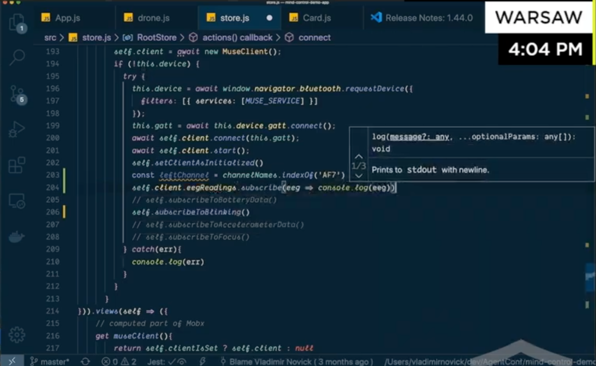
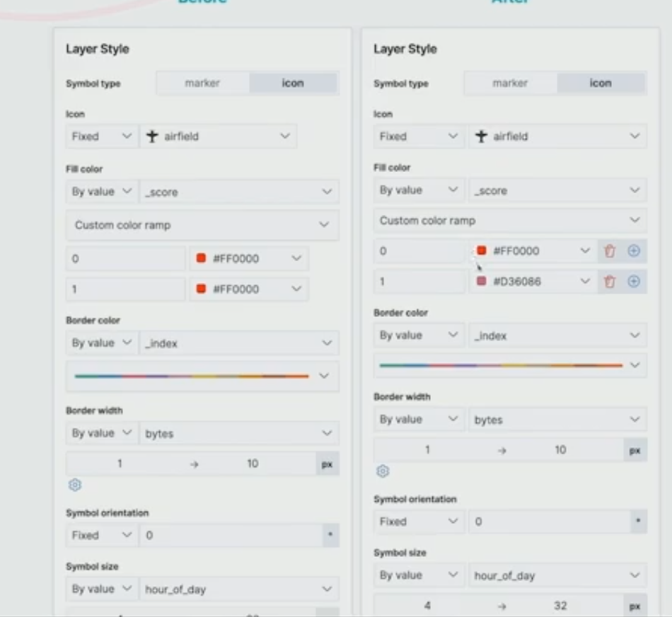
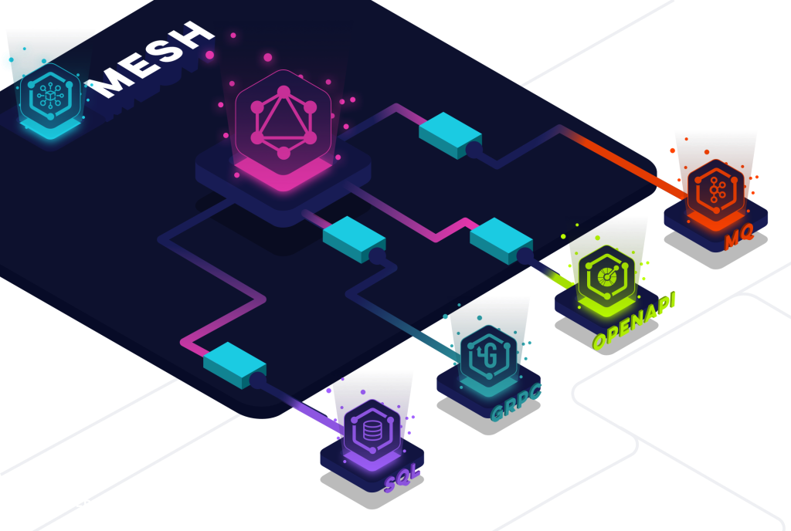
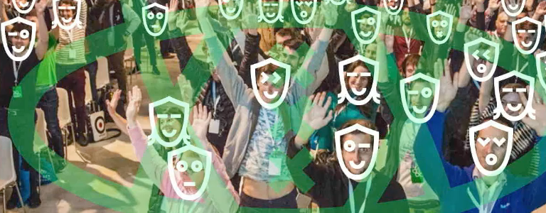

---

title: 'React Summit Remote Edition Highlights'
description: ""
pubDate: 2020-04-21
tags: "accessibility, development, front-end, frontend, frontend conference, graphQL, javascript, open source, React, React Conference, ReactSummit"
image: "../images/2020-04-reactsummitworkout.png"
imgAlt: "The host working out in the React Summit"
hideHero: true
---
When the year started I was looking to attend to React Summit in Amsterdam. So I was super happy to hear that they were doing a remote edition. Woke up at 5:30 am to attend and it was totally worth it! Specially the workout break!!!


Let me show you some of the highlights:

## Mystery talk

Guillermo Rauch showed us how NextJS has been moving towards a JAMStack to enable modern sites to be closer the the edge. Under the premise that everything that could be static should be static following this approach we can leverage CDN networks to serve our sites closer to our users. He also shared some amazing thoughts on how in 2020 NextJS is focusing more into integrating PWA concepts into features as for example offline first pages. Some links I found after the talk:

- [PWA with NextJS](https://itnext.io/pwa-with-next-js-create-next-app-in-2020-%EF%B8%8F-9ee0e1a6313d)
- [Offline First in NextJS Github issue](https://github.com/zeit/next.js/issues/861)
- [Zeit](https://zeit.co/) as a platform to deploy on the edge
- [Static generation on NextJS](https://nextjs.org/docs/basic-features/data-fetching#getstaticprops-static-generation)
- An amazing doodle from [David Leuliette](https://twitter.com/flexbox_)

## Controlling Apps with Your Mind and AI

Vladim Novick showed us how we can start building the apps of the future today. He did a demo on how we can leverage current technologies (VR, AR, web bluetooth and brainwave devices) to fly a quadcopter with you mind! And he also promised to start some tutorials in his [egghead channel](https://egghead.io/instructors/vladimir-novick)

A quick snapshot of the code he showed:



#### Resources

- [Brainwaves tutorial in EEGEdu](https://eegedu.com/)
- [Muse 2016 EEG Headset JavaScript Library (using Web Bluetooth)](https://github.com/urish/muse-js)
- [Hacking your brainwaves](https://www.diygenius.com/hacking-your-brain-waves/)

I am looking forward to get one of those devices and start making some side projects.

## AHA Programming

Based on a blog post from Sandi Metz ([The wrong abstraction](https://www.sandimetz.com/blog/2016/1/20/the-wrong-abstraction)) Kent C. Dodds presented a new pattern he has been promoting for a while: AHA (Avoid Hasty Abstractions). He basically showed us why sometimes by trying to be DRY (Don't repeat yourself) we end up with complex solutions that are harder to maintain.

#### key takeaways

- DRY/WET (Write Everything Twice) are not necessarily a bad thing. It is always a tradeoff, so it is better to start copying until the right abstractions emerge.

- You can never tell how something will evolve, so always optimize for change.

- Duplication is far cheaper than the wrong abstraction.

- Refactor when code gets out of hand. Based on Sandi Metz, you can follow some simple steps to achieve this:

  - Duplicate the abstraction (1 per usage)
  - Refactor each of them to solve that use case
  - Remove the old abstraction and see if there are worth commonalities to build another

- Never hesitate to remove code that is only being used in a test case (and it does not have a business case)

#### Resources

- [AHA Programming](https://kentcdodds.com/blog/aha-programming)
- [AHA Testing](https://kentcdodds.com/blog/aha-testing)
- [Presentation slides](https://github.com/kentcdodds/aha-programming-slides)
- [DRY vs WET vs AHA coding styles](https://www.indiehackers.com/post/dry-vs-wet-vs-aha-coding-styles-1762a1fc9d)

## Scalable React Development for Large Projects

Jason Gene explained how they created [Nx](https://nx.dev/) to allow Mono Repository development to scale.

#### Takeaways

- Mono repos simplify development by making all the code available

- It does not mean you need to build or deploy everything at once. It is only storage that is shared

- Usually requires more tooling to enable the workflows. NX provides those:

  - Dependency management
  - Dependency analysis
  - Run tests only for affected modules

- Mono Repositories simplify some workflows, specially sharing code and testing dependencies

## Designing with Code in Mind

Elizabet Oliveira explained how in her experience being a designer that knows code helped her collaborate better with developers. She showed the [design library](https://elastic.github.io/eui/#/) they use at their work and explained how she approaches working with developers:

- Design and development is an iterative process and requires collaboration.
- Design with code in mind. A design system helps.
- When innovating, sketch first, don't necessarily use the design system. The goal is to change, so you need to break the rules.
- There is no such thing as perfect pixel design, instead we should dedicate to pixel perfect code! For example she showed how went for before and after in a feature, by submitting a PR with the CSS updates



## React Query: It’s Time to Break up with your "Global State”!

Tanner Linsley gave some insight on common issues with state management. His main focus was client state vs server state and also used that opportunity for a shameless plug: How using `react-query` you can avoid most of these issues.

#### Takeaways

- Client state is all the data that is usually not persisted or depends on a session while server state is all the data that is not managed by client and usually persisted.

- Managing server state globally is usually tempting, as it is easy to share across and avoid prop drilling. But it can be more dangerous than it looks.

- Some challenges when managing server state are:

  - Caching: when to cache requests and how to invalidate the cache.
  - Deduping requests: What happens when multiple components request the same resource.
  - Background updates: How to synchronize the data to keep it fresh.
  - Outdates requests: Cache invalidation, push, other types of comm.
  - Mutations: Changes to the server, optimistic updates strategies, etc.
  - Pagination: How to request resources efficiently.
  - Memory: What to store and when, how to control memory usage.

- [React-query library.](https://github.com/tannerlinsley/react-query) It has similar feature than for example `Apollo Client` but does not depend on `Apollo` as it could be used with `Rest` or any other data layer.

## Lightning talks

At the end there were some quick light talks, with super interesting topics to keep exploring.

### Going Live from your Browser without WebRTC

Matt McClure explained the difference between chat and live streaming, showed how you can setup a livestream web application almost without a server.

#### Takeaways

- Chat apps are focused on 2/n way communication between clients. Latency is critical to have a successful app.
- Live Broadcasting is 1 to many communication, usually involving a server (as there are different protocols involved).
- Chat apps are usually powered by [WebRTC](https://webrtc.org/)
- Live broadcasting instead uses [RTMP](https://www.adobe.com/devnet/rtmp.html) and [HLS](https://www.dacast.com/blog/hls-streaming-protocol/)
- [Quick demo](http://mmcc-next-streamr.glitch.me/) on how to use webRTC and web sockets to develop a live broadcasting web application. Take a look to his [post](https://mux.com/blog/the-state-of-going-live-from-a-browser/) to learn more and see some code!!

### Button vs Div: What's the Big Deal Anyway?

Jen Luker showed why it is important to leverage HTML tags properly to be accessible first. She showed how you can make a button with `<button>` vs making it a `<div>` with and how that code gets out of hand when trying to make it accessible.

Here is the full example of everything required if you don't use proper semantic tags:

```js
import React from 'react'
import '../App.css'

const allowedKeys = ['Enter', 'Space']

const DivButton = ({ hideText, setHideText }) => {
  return (
    <div
      role="button"
      tabIndex="0"
      onClick={() => setHideText(!hideText)}
      onKeyPress={e => {
        allowedKeys.indexOf(e?.code) > -1 &&
          setHideText(!hideText)
      }}
      css={{
        // Did you forget about this? I forgot about this.
        display: 'inline-block',
        textAlign: 'center',
        color: 'buttontext', // this is a thing?
        borderRadius: 2, // so tiny, so cute
        backgroundColor: '#EFEFEF', // The 2000's called...
        boxSizing: 'border-box', // #love
        padding: '1px 7px', // huh. 7px. Not my first guess.
        border: '1px outset #767676', // random, but okay
        cursor: 'pointer' // iOS: "No pointer? no clicky."
      }}
    >
      I am a div
    </div>
  )
}

export default DivButton
```

Check the full example in her [Github](https://github.com/knitcodemonkey/react-button-vs-div)

### Bringing Ionic (and Web Components) to React

Mike Hartington explained how they decided to start supporting [React in Ionic](https://ionicframework.com/docs/react).

#### What is Ionic?

[Ionic](https://ionicframework.com/) is a framework to develop hybrid applications. It allows to maintain one source code and deliver apps across native and web platforms.

#### Resources

- [Announcing React in Ionic.](https://ionicframework.com/blog/announcing-ionic-react/)
- [With native progressive web apps with Ionic.](https://ionicframework.com/react)
- [Building Mobile Apps with React and Ionic.](https://www.smashingmagazine.com/2019/08/building-mobile-apps-ionic-react/)

### GraphQL Mesh – Query Anything, Run Anywhere

Uri Goldsthein showed how by using [GraphQL Mesh](https://graphql-mesh.com/) framework we can quickly integrate systems together. In simple words GQL Mesh provides connectors to multiple interfaces allowing to build an adapter layer that will quickly enable exposing APIs from any service. It also allows both schema stitching and federation.

Some resources:

- [GraphQL Mesh website](https://graphql-mesh.com/)
- [Query anything, run everywhere](https://medium.com/the-guild/graphql-mesh-query-anything-run-anywhere-433c173863b5)
- [Quick intro](https://dev.to/graphqleditor/graphql-mesh-1474)



Also, I loved the diagrams and graphics he used in his presentation (like the one above). I am planning to create some templates to build similar looking diagrams for my projects!

---

It was a super fun conference, I am looking forward to try some of the things I learned, and hoping to share some projects soon.



Enjoy!!!
