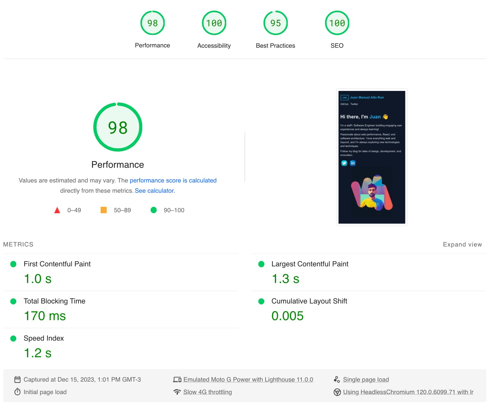

I've finally decided to transition away from Wordpress and create a custom setup. Yes, I'm another engineer with the seemingly crazy idea of building my own blog (shocking, I know).

In this blog post, I aim to explain why I made this decision and share some of the insights I've gained along the way!

## Why did I Leave WordPress?

There are several key reasons why I decided to build a custom website instead:

### Reached WordPress Limits

Don't get me wrong, WordPress has been an incredible tool for years. However, I kept hitting storage capacity limits and content constraints that made upgrading feel like trying to cram a square peg into a round hole. It was time to find a better fit.

### Wanted Markdown Freedom

I was tired of toggling between platforms to write and publish content. I wanted the simplicity of drafting posts directly as markdown files without a digital middleman getting in my way. No more obstacles between me and my work!

### Excited by Static Sites

I became fascinated with the speed and security of static sites built from pre-made HTML instead of databases. I couldn't wait to optimize my blog by wiring it up this way from the ground up!

### Craved Customization

Finally, I was hungry for more creative freedom over theming, functionality tweaks, plugins - you name it! Rolling my own site meant total control to build a platform as unique as my needs.

## Why I Chose Astro

I decided to build my site with Astro for a few reasons:

### Exploring a new framework

I am always looking for opportunities to learn new things and I’ve been wanting to try AstroJS for a while!

### Easy Markdown

Astro makes writing in markdown simple and quick to get started. No complex setup - I can just focus on creating content.

### Blazing Fast

But the big draw was Astro's speed potential, generating lightweight prebuilt HTML that zips with performance. My blog will load swiftly right out of the gate while still offering flexibility.



[See full performance snapshot details](https://pagespeed.web.dev/analysis/https-juanmanuelalloron-com/dpdp0nzkjv?form_factor=mobile)

While Astro is still young, it offers the right combo of features for my needs. I'm excited to grow with this promising new framework!

## Templates

Astro offers a good set of starter projects. I used this one to inspire my design:

- https://astro.build/themes/details/astro-boilerplate/

If you are looking for some inspiration or starters check out my [Astro Themes and Templates to Power Your Next Build post](/post/astro-themes-templates-power-next-build/)

## Technical Details

In the following part I’ll lay down some things I learned that are useful for everyone putting together a blog with Astro.

### Markdown and plugins

Astro comes with MD integration out of the box, so I didn’t need to do much. 

It also supports remark and Rehype plugins so there is a lot of customization that can be done. I added a few useful plugins that I needed:

- [Rehype Slug](https://github.com/rehypejs/rehype-slug) and [Rehype Autolink Headers](https://github.com/rehypejs/rehype-autolink-headings) to make my Headings linkable as a URL.
- [Rehype Class Names](https://github.com/riderjensen/rehype-class-names) to style certain elements
- [Rehype External Links](https://github.com/rehypejs/rehype-external-links) to add much needed security measures to external links.

Here is what my Astro config looks like:

```jsx
markdown: {
    shikiConfig: {
      theme: "dracula",
    },
    rehypePlugins: [
      rehypeSlug,
      [rehypeAutolinkHeadings, { behavior: "wrap" }],
      [rehypeClassNames, { "p a, li a": "highlight", img: "mdImage" }],
      [rehypeExternalLinks, { rel: ["nofollow noopener noreferrer"], target: '_blank' }],
    ],
  },
```

### Recommended posts

I wasn’t planning on doing anything fancy for recommended posts. So I decided to ask ChatGPT to create an algorithm that would take tags and provide a list of recommendations. 

Here is the algorithm:

```jsx
// Function to calculate Jaccard similarity between two sets
function jaccardSimilarity(setA, setB) {
    const intersection = new Set([...setA].filter(tag => setB.has(tag)));
    const union = new Set([...setA, ...setB]);
    return intersection.size / union.size;
}

// Function to find 4 most similar posts
function findSimilarPosts(selectedPost, allPosts) {
    const selectedTags = new Set(selectedPost.split(', '));

    const similarityScores = [];

    // Calculate similarity scores for all posts
    for (const post of allPosts) {
        const postTags = new Set(post.split(', '));
        const similarity = jaccardSimilarity(selectedTags, postTags);
        similarityScores.push({ post, similarity });
    }

    // Sort posts by similarity in descending order
    similarityScores.sort((a, b) => b.similarity - a.similarity);

    // Select the top 4 similar posts
    const similarPosts = similarityScores.slice(0, 4).map(item => item.post);
    return similarPosts;
}

// Example usage:
const selectedPost = "web, frontend, development";
const allPosts = [
    "frontend, web, design",
    "web, development, coding",
    "frontend, design, UI",
    "backend, database, API",
    "web, UI, responsive",
    "frontend, web, CSS"
];

const similarPosts = findSimilarPosts(selectedPost, allPosts);
console.log("Similar posts:", similarPosts);
```

I also learned the `Jaccard Similarity algorithm` along the way. 

[Learn more about Jaccard Similarity here](https://www.educative.io/answers/what-is-the-jaccard-similarity-measure-in-nlp)

### Analytics

The google Analytics integration was quite straightforward:

1. Create a google analytics account
2. Leverage [Partytown](https://partytown.builder.io/) as a plugin to load GA
3. Paste the GA script in the header.

[You can follow the steps in this tutorial](https://www.freecodecamp.org/news/how-to-add-google-analytics-to-your-astro-website/)

The most exciting part for me was leveraging Partytown. I am always worried about scripts affecting the page load and Partytown handles this seamlessly by moving scripts to web workers.

Also the integration with Astro was super simple! Only adding a property to the Astro config:

```jsx
integrations: [
    partytown({
      config: {
        forward: ["dataLayer.push"],
      },
    }),
  ],
```

### Migrating the content

I already had lots of posts in WordPress, so I needed to ensure they were migrated to MD and that 301 redirects from my old slugs were correctly implemented.

### 301 Redirects

Astro offers a static way to define redirects in the config. This was perfect for me so I added a `redirects.js` file that holds all that data. Here is a snippet: 

```jsx
"/2014/10/28/starting-a-new-trip/": "/post/starting-a-new-trip/",
"/2014/10/28/design-is-a-process/": "/post/design-is-a-process/",
"/2014/11/05/how-to-measure-design-effectiveness/": "/post/how-to-measure-design-effectiveness/",
"/2015/05/24/74/Robert-Fabricant-Quote": "/post/robert-fabricant-quote/",
"/2015/10/09/programmers-coders/": "/post/programmers-coders/", 
```

Unfortunately, for statically deployed sites, this results in a soft 301 (the page is loaded with a redirect link). You can only get actual 301 responses by deploying Astro in hybrid mode, but I decided this was not worth the effort and moved on.

### Wordpress to Markdown

Wordpress offers an export tool and there a several open source libraries that support converting that to MD. I picked [wordpress-to-markdown](https://github.com/lonekorean/wordpress-export-to-markdown) as it seem simple enough. I had to do some quick modifications to support the model I wanted:

- Used `rehype-remove-comments` to cleanup some of Wordpress specific content
- Changed the structure to put all images under one folder
- Changed the converter to have a single file per post
- Replaced each referenced URL to the base image path inside my content folder.
- Finally, I also used this to generate my redirects file.

It was a fun and straightforward experience that enabled me to transfer most of the content quickly. After that, I had to make some manual tweaks myself, especially around code snippets. WordPress snippets weren't always correctly converted, particularly for older WordPress code snippet formats.

### Generating images for older posts

My new design heavily relies on images for the posts gallery. Some of the older posts didn't have a hero image I could use, so I decided to quickly create them.

I use [unsplash](https://unsplash.com/) all the time but this time I also decided to generate a default hero image with [leonardo AI](https://leonardo.ai/): 


### Hosting and Domain

I decided to host my site in Github pages. 

- It’s super simple to run a Github action to update the site.
- It supports custom domains
- It would give me a platform to also host small FE experiments. Like for example the [drum-kit website](https://juanmanuelalloron.com/agi-playground/music/drum-kit/)

One thing to consider would be scale. **GitHub Pages has a soft bandwidth limit of 100 GB per month.** I checked my previous posts and on average each post is not larger than 50kb. So that means I can serve more than 2 million pages before Github tries to throttle me. 

Finally, my domain is on Wordpress (I bought it a while back). It was pretty simple to migrate. [I followed the tutorial from Github Pages.](https://docs.github.com/en/pages/configuring-a-custom-domain-for-your-github-pages-site/managing-a-custom-domain-for-your-github-pages-site) 

## Future Plans

It was a great adventure and I am already seeing the flexibility that I needed. I am also already seeing some opportunities to continue improving how I blog:

### Schedule posts

Right now I can create the markdown content, mark it as draft, but I don’t have an automation to schedule when I want to post it. 

Here is what I am thinking:

- Add a ScheduleDate property
- Have a daily Github Action that will check those dates and  publish the posts.

### Automate posting to social media via IFTTT

I’ve been doing some research and I can potentially leverage my RSS feed to automate posting the blog posts to Linkedin, Reddit and probably others.

Unfortunately Twitter (a.k.a as X) is making it harder and harder to automate this 😡

### Test it

It’s never going to be finished until I test some parts. I plan to use tests to make sure the integrity of previous posts is not affected by future changes I could make. 

I want to use playwright to test the MD to HTML output and some basic functionality (like tags, recommended, links, anchors, etc)

I also want to experiment with [Open Graph Scraper](https://github.com/jshemas/openGraphScraper) to make sure my sharing meta is always accurate.