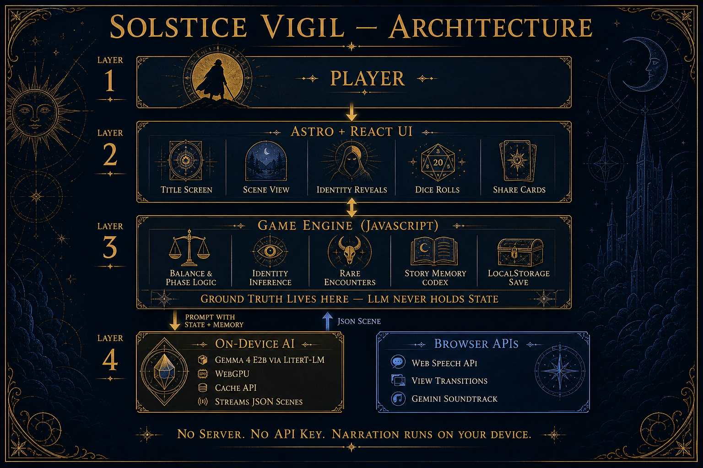

At the June solstice, the sun stopped setting. You are the wanderer trying to keep day and night from tipping over completely.

That is the premise of **[SOLSTICE VIGIL](https://solstice-vigil.vercel.app/)**, a solo narrative RPG I built for the [DEV June Solstice Game Jam](https://dev.to/challenges/june-game-jam-2026-06-03). Each choice moves a balance meter between the Long Day and the Hush of Night. Push too far and the vigil ends. There is no boss fight — just a count of how many days you held the wheel, what you became along the way, and which strange things you stumbled into.

I wanted it to feel like an old manuscript you could actually play: mythic, a little lonely, not very chatty.

**[Play it →](https://solstice-vigil.vercel.app/)** · **[Source on GitHub →](https://github.com/juanallo/solstice-vigil)**

## What you can do

- **Balance day and night.** The meter drives phase, mood, and how close you are to tipping over.
- **Get scenes narrated on your own device.** Gemma 4 (E2B) runs in Chrome through [Google AI Edge LiteRT-LM](https://ai.google.dev/edge) and WebGPU. No server, no API key, nothing leaving the machine.
- **Earn identities instead of picking a class.** Titles like *Ember Saint* or *Moon Herald* show up after your choices pile up.
- **Find rare encounters.** Fifteen of them, with a codex, eligibility rules, and cards worth sharing.
- **Roll a d20** on bold choices. Sometimes the solstice pushes back.
- **Turn on speech narration** if you want the scene read aloud. Music ducks while it plays.
- **Try demo mode** if you do not want to download the ~2 GB model. The full loop works with hand-written scenes.

Demo mode is on the title screen, via `?demo=1`, or from the link on the loading screen.

## The split that makes it work

The diagram is the important part. JavaScript owns the game: balance, endings, identities, encounters, dice. Gemma gets structured context and returns JSON. It narrates; it does not decide outcomes.

That split is why on-device generation feels playable past the first few scenes instead of falling apart. If the model were also deciding whether you tipped into eternal day or earned a rare encounter, coherence would fall apart fast. Plain JavaScript handles the rules; the model handles the voice.

Places to start reading in the repo:

- `src/components/game/SolsticeVigil.tsx` — game loop, on-device LLM, UI states
- `src/lib/prompt.ts` — narrator prompt and turn context
- `src/lib/identity.ts` / `src/data/identities.ts` — inferred wanderer titles
- `src/lib/encounters.ts` / `src/data/encounters.ts` — rare wonders
- `src/lib/dice.ts` — d20 resolution
- `tests/` — Playwright unit + E2E (demo mode for CI)

## How I built it

### On-device Gemma 4

I built this because I wanted to try Gemma 4, and Chrome's on-device LLM path made that possible without standing up a backend.

The game loads `@litert-lm/core` from a CDN, pulls the Gemma 4 E2B `.litertlm` file from Hugging Face, caches it with the Cache API, and streams scene JSON over WebGPU. Save state lives in `localStorage`. The model narrates; JavaScript decides.

### The shell and the manuscript UI

Astro + React was the shell. Static delivery, React island for the game, room to grow if the vigil ever becomes more than one page.

View Transitions handle screen and scene changes. Phase flips and identity reveals feel less like hard cuts that way.

I also went looking for newer CSS worth using. `border-shape` gives the notched manuscript frames; `clip-path` covers browsers that do not have it yet. The design spec in the repo (`docs/design.md`) describes the mood: dark mythic fantasy, gold daylight against cold blue shadow, ruined stone and ritual stillness.

On top of that: Web Speech for optional narration, [Gemini](https://gemini.google.com/) for the two soundtrack pieces (*The Wheel of Sediment*, *Vigil of the Still Valley*) — same toolchain as [The SDLC Song Cycle](/post/sdlc-song-cycle-ai-music-on-the-blog/) — and Playwright + TDD because agent-written code looks fine until you actually click through it.

## Building mostly from my phone

Most of this was built from my phone. I am a full-time dad, so "can I keep working while away from the desk" was not a bonus constraint. It was the whole point.

I started with a version of my grill-me skill in ChatGPT. What is the loop? Why would anyone share a run? Why solstice, specifically? That argument became the PRD.

Then I moved to [Zo Computer](https://zo.computer/) and got the first playable prototype working away from my desk: balance meter, phase flip, on-device Gemma, local save. The production app came after that proof.

For visuals I used Google Stitch and ChatGPT to try directions fast. Dense or spacious? Dashboard or manuscript? Gold day or blue night? The spec in `docs/design.md` is what survived that round.

Desktop Cursor was the one part I could not do on my phone. Once the direction was clear, I ran several implementation plans in parallel. Same shape as the workflow I wrote up in [My Current AI Workflow for Building Apps](/post/my-current-ai-workflow-for-building-apps/): argue the idea first, prototype early, design before you let agents run loose, ship in small slices, test the behavior for real.

## Demo walkthrough

The desktop demo covers the premise, on-device Gemma loading, an identity reveal, a rare encounter, a d20 roll, and demo mode.

<video src="https://raw.githubusercontent.com/juanallo/solstice-vigil/main/demo-final/solstice-vigil-demo-final.mp4" controls style="max-width:100%;border-radius:8px;margin:1em 0;">

There is also a [mobile walkthrough](https://raw.githubusercontent.com/juanallo/solstice-vigil/main/demo-final/solstice-vigil-demo-final-mobile.mp4) recorded from Zo.

## Why Gemma is the game loop, not decoration

I submitted SOLSTICE VIGIL for the jam's **Best Google AI Usage** category.

Gemma 4 (E2B) through Google AI Edge LiteRT-LM is the game loop, not decoration. Every live scene is generated on-device in Chrome. The model gets game state, story memory, identity context, and encounter history, then returns JSON the engine can parse.

Gemini wrote the soundtrack. Google Stitch helped me pick a UI direction before I started coding.

The part I care about most: the LLM is a narrator, not a game master. Balance, endings, identity tiers, encounter eligibility, and dice outcomes are plain JavaScript. That is the same instinct behind keeping notation strict in [Teaching LLMs to Play the Drums](/post/teaching-llms-to-play-the-drums/) — give the model a clear job, keep the rules elsewhere.

---

Thanks for playing. The wheel turns.

If you try a run, I would love to hear what title you earned — [@juan_allo](https://x.com/juan_allo) is the easiest place to reach me. The [DEV submission write-up](https://dev.to/juan_allo/solstice-vigil-a-solo-rpg-narrated-by-gemma-4-in-your-browser-1jp1) has a few extra jam details if you want the challenge format.
