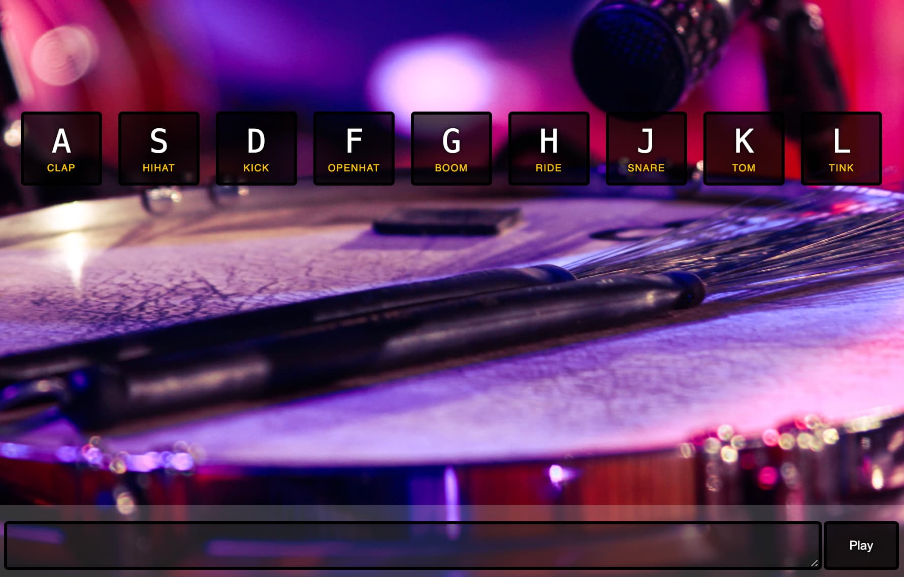

I’ve been playing quite a bit with LLMs and while they are great at producing text you can also do other things with some tricks. 

In this experiment I created a text notation so ChatGPT, [Claude.AI](http://Claude.AI) and Bard could create some music with it. 

NOTE: I don’t know how to play the drums myself, so some of this might be wrong. Feel free to message me at [juan_allo](https://twitter.com/juan_allo) and I’ll make updates!

The basic prompt goes like this:

```
You are a drums expert. I am going to give you a notation and we are going to write some music together.
Let's say letters represent sounds.

[ { "key": "A", "sound": "clap" }, { "key": "S", "sound": "hihat" }, { "key": "D", "sound": "kick" }, { "key": "F", "sound": "openhat" }, { "key": "G", "sound": "boom" }, { "key": "H", "sound": "ride" }, { "key": "J", "sound": "snare" }, { "key": "K", "sound": "tom" }, { "key": "L", "sound": "tink" } ]

- You can also use P to represent a pause.
- A song is written in a line.
- You can use multiple lines to represent sounds that are played at the same time.
- No spaces better the letters.
- You can use / to represent different sections.
```

A song example would look like the following:

```
DPDPDPDPDPDPDPDPDPDPDPDPDPDPDPDPDPDPDPDPDPDPDPDPDPDPDPDPDPDP
SPSPSPSPSPSPSPSPSPSPSPSPSPSPSPSPSPSPSPSPSPSPSPSPSPSPSPSPSPSPSP
JPJPJPJPJPJPJPJPJPJPJPJPJPJPJPJPJPJPJPJPJPJPJPJPJPJPJPJPJPJPJP
```

Like a simple roll pattern doing the Kick, the Hi-Hat and the Snare at the same time

## 🎮 The Player's Interface: From Wes Bos to Sonic Bliss

Why stick to the mundane when you can groove with the keys? I borrowed inspiration from Wes Bos's Javascript 30 challenge—the Drum Kit. The result? An interactive interface where you can not only visualize but play the drums using your keyboard. Pure auditory and visual ecstasy!



Feel the beat at [juanmanuelalloron.com/agi-playground/music/drum-kit/index.html](https://juanmanuelalloron.com/agi-playground/music/drum-kit/index.html).

## 🎶 The Tunes: An AI-Infused Symphony

Here are some of the tunes the different AIs created. 

- [Percussive Frenzy](https://juanmanuelalloron.com/agi-playground/music/drum-kit/?song=DGDGJDFGJDFGJDSDFFSDFFSDGDGJDFGJDFGJDSDFFSDFFSDGDGJDFGJDFGJDSDFFSDFFSDGDGJDFGJDFGJDSDFFSDFFS%250AKPKPKPKPKPLPLPLPLPLKLKLKPKPKPKPKPLPLPLPLPLKLKLKPKPKPKPKPLPLPLPLPLKLKLKPKPKPKPKPLPLPLPLPLKLKL%250ASPSPSPSPSPFPFPFPFPSASASSPSPSPSPSPFPFPFPFPSASASSPSPSPSPSPFPFPFPFPSASASSPSPSPSPSPFPFPFPFPSASAS%250ADGDGJDFGJDFGJDSDFFSDFFSDGDGJDFGJDFGJDSDFFSDFFSDGDGJDFGJDFGJDSDFFSDFFSDGDGJDFGJDFGJDSDFFSDFFS%250A%2F%250AKPKPKPKPKPLPLPLPLPLKLKLKPKPKPKPKPLPLPLPLPLKLKLKPKPKPKPKPLPLPLPLPLKLKLKPKPKPKPKPLPLPLPLPLKLKL%250ASPSPSPSPSPFPFPFPFPSASASSPSPSPSPSPFPFPFPFPSASASSPSPSPSPSPFPFPFPFPSASASSPSPSPSPSPFPFPFPFPSASAS%250A%2F%250ADGDGJDFGJDFGJDSDFFSDFFSDGDGJDFGJDFGJDSDFFSDFFSDGDGJDFGJDFGJDSDFFSDFFSDGDGJDFGJDFGJDSDFFSDFFS%250AKPKPKPKPKPLPLPLPLPLKLKLKPKPKPKPKPLPLPLPLPLKLKLKPKPKPKPKPLPLPLPLPLKLKLKPKPKPKPKPLPLPLPLPLKLKL%250ASPSPSPSPSPFPFPFPFPSASASSPSPSPSPSPFPFPFPFPSASASSPSPSPSPSPFPFPFPFPSASASSPSPSPSPSPFPFPFPFPSASAS%250ADGDGJDFGJDFGJDSDFFSDFFSDGDGJDFGJDFGJDSDFFSDFFSDGDGJDFGJDFGJDSDFFSDFFSDGDGJDFGJDFGJDSDFFSDFFS%250A%250ADGDGJDFGJDFGJDSDFFSDFFSDGDGJDFGJDFGJDSDFFSDFFSDGDGJDFGJDFGJDSDFFSDFFSDGDGJDFGJDFGJDSDFFSDFFS%250AKPKPKPKPKPLPLPLPLPLKLKLKPKPKPKPKPLPLPLPLPLKLKLKPKPKPKPKPLPLPLPLPLKLKLKPKPKPKPKPLPLPLPLPLKLKL%250A%2F%250ASPSPSPSPSPFPFPFPFPSASASSPSPSPSPSPFPFPFPFPSASASSPSPSPSPSPFPFPFPFPSASASSPSPSPSPSPFPFPFPFPSASAS%250A%2F%250AJPKLSDFFJPKLSDFFJPKLSDFFJPKLSDFFJPKLSDFFJPKLSDFFJPKLSDFFJPKLSDFFJPKLSDFFJPKLSDFFJPKLSDFF%250ASPFPKPFPDPSJKLSJKLSJKLSJKLSJKLSJKLSJKLSJKLSJKLSJKLSJKLSJKLSJKLSJKLSJKLSJKLSJKLSJKLSJKLS%250AKPKPKPKPKPKPKPKPKPKPKPKPKPKPKPKPKPKPKPKPKPKPKPKPKPKPKPKPKPKPKPKPKPKPKPKPKPKPKPKPKPKPKPKP%250A%2F%250AFFFFFFFFFF%250ALLLLLLLLLL)
- [Rock n' Roll Ride](https://juanmanuelalloron.com/agi-playground/music/drum-kit/?song=D_D_D_D_D_D_D_D_D_D_D_D_D_D_D_D_%250AS__S__S__S__S__S__S__S__S__S__S__S__%250AH_H_H_H_H_H_H_H_H_H_H_H_H_H_H_H_H%250A%2F%250AT_T__T__T__T__T__T__T__T__T__T_T_T_%250AF__F__F__F__F__F__F__F__F__F__F__F__%250AK_K__K__K__K__K__K__K__K__K__K__K_K_%250A%2F%250AD_D_D_D_D_D_D_D_D_D_D_D_D_D_D_D_D_%250AS__S__S__S__S__S__S__S__S__S__S__S__S%250AH_H_H_H_H_H_H_H_H_H_H_H_H_H_H_H_H_H%250A%2F%250AT_T__T__T__T__T__T__T__T__T__T__T_T%250AF__F__F__F__F__F__F__F__F__F__F__F__F%250AK_K__K__K__K__K__K__K__K__K__K__K_K_)
- [Carnaval Jam](https://juanmanuelalloron.com/agi-playground/music/drum-kit/?song=D_D_D_D_J_S_D_D_D_D_J_S_D_D_D_D_%250AS__S__P__P__S__S__P__P__S__S__P__P_%250AH_A_H_H_A_H_A_H_H_A_H_H_A_H_H_A_H_%250A%2F%250AK__K__G__G__K__K__G__G__K__K__G__G_%250AF_P_F_F_P_F_P_F_F_P_F_F_P_F_F_P_F_%250AT_T_K_T_T_K_T_T_K_T_T_K_T_T_K_T_T_%250A%2F%250AJ_S_D_D_D_D_J_S_D_D_D_D_J_S_D_D_D_%250AP__P__S__S__P__P__S__S__P__P__S__S_%250AA_H_H_A_H_H_A_H_H_A_H_H_A_H_H_A_H_H%250A%2F%250AG__G__K__K__G__G__K__K__G__G__K__K_%250AP_F_F_P_F_F_P_F_F_P_F_F_P_F_F_P_F_F%250AK_T_T_K_T_T_K_T_T_K_T_T_K_T_T_K_T_T)
- [Energetic Harmony](https://juanmanuelalloron.com/agi-playground/music/drum-kit/?song=JPPPJPPPA%250A%2F%250AASDF%2520ASDFA%250AJPJP%2520JPJP%2520JPJP%2520JPJP%250ASPHP%2520SPHP%2520SPHP%2520SPHP%250AKPPP%2520PKPP%2520PPKP%2520PPPK%250A%2F%250AASDF%2520ASDFA%250AJPJP%2520JPJP%2520JPJP%2520JPJP%250ASPHP%2520SPHP%2520SPHP%2520SPHP%250AKPPP%2520PKPP%2520PPKP%2520PPPK%250A%2F%250AASDF%2520ASDFA%250AJPJP%2520JPJP%2520JPJP%2520JPJP%250ASPHP%2520SPHP%2520SPHP%2520SPHP%250AKPPP%2520PKPP%2520PPKP%2520PPPK%250A%2F%250AASDF%2520ASDFA%250AJPJP%2520JPJP%2520JPJP%2520JPJP%250ASPHP%2520SPHP%2520SPHP%2520SPHP%250AKPPP%2520PKPP%2520PPKP%2520PPPK%250AASDF%2520ASDFA%250AJPJP%2520JPJP%2520JPJP%2520JPJP%250ASPHP%2520SPHP%2520SPHP%2520SPHP%250AKPPP%2520PKPP%2520PPKP%2520PPPK)

## Next Steps

This is only the beginning, I would like to explore creating a whole UI that will generate music from a prompt!

I also want to add a little bit more complexity to the notation. You are still missing the tempo (right now I am using a 200ms delay between sounds)

## Learnings

Some LLMs were better at understanding and following of the notation than others. For example [Claude.ai](http://Claude.ai) picked it right away and it even produced some nice improvs.

Doing covers hasn’t worked well yet. I asked all the LLMs to make a cover of Wipe Out (The Surfaris) and none produced something close. 

I tried upload drum sheets to Bard and it kind of produced the song in these notation. Something to definitely keep exploring. 

— 

If you liked this post feel free to play with the music yourself! Can’t wait to see what you create 🙂