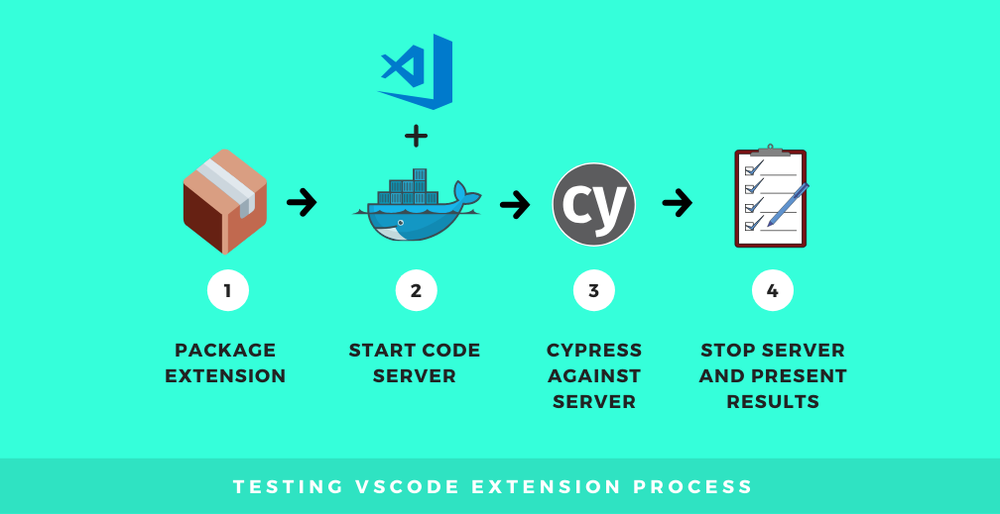
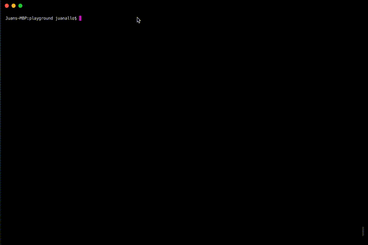
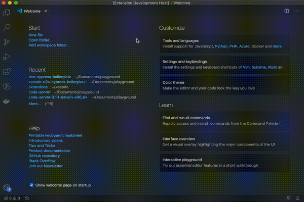
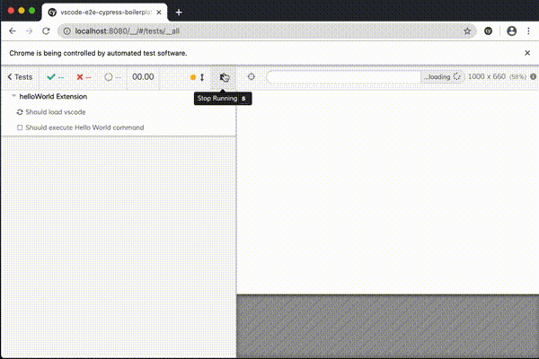

---

title: 'Testing VSCode Extensions with Cypress and code-server'
description: "There are 4 steps involved in this setup and I’ll explain in detail how to do it."
pubDate: 2020-05-05
tags: "cypress, development, test, testing, vscode, vscode extension"
image: "../images/2020-04-vscode-e2e.png"
imgAlt: ""
hideHero: true
---
Recently I started working on a Visual Studio extension: a [dependency visualizer for js/ts projects](https://marketplace.visualstudio.com/items?itemName=juanallo.vscode-dependency-cruiser&ssr=false#overview) (still in early alpha). While working on it I started digging on how to test extensions.

Visual Studio has a nice setup to do unit testing but I was looking to go further. I wanted to do some BDD and define test cases closer to my acceptance criteria.

So, I ended up playing with Cypress and setting up a way to test extensions E2E. There are 4 steps involved in this setup and I'll explain in detail how to do it.



The setup I ended up with involves using docker and code-server to run a web version of vscode. Cypress will connect to that server and run test cases. You can see the full configuration in the [Github repository.](https://github.com/juanallo/vscode-e2e-cypress-boilerplate)

Let's dig into it:

## Basic vscode extension

To get started, we can leverage the example from the [vscode getting started section](https://code.visualstudio.com/api/get-started/your-first-extension). Essentially it creates all the boilerplate for a Hello world extension. You can activate the `Hello World` command and it will show a notification.

To install it we use Yeoman: `yo code` Follow all the instructions and you will have a basic extension. For more instructions check [vscode getting started docs.](https://code.visualstudio.com/api/get-started/your-first-extension)



**Note**: I used javascript for my example, but most of this tutorial should work with Typescript too.

This is how hello world extension looks like:



## Packaging the extension

To get our extension installed in our local web vscode we will need to package it first. There is a CLI we can use to do this. But first we need to make sure we add the following to the package.json:

- publisher: Name of the extension publisher. This is required to package an extension and eventually to publish it to the marketplace.
- repository information: URL to the extension github.

The file should look like this after:

```json
{
    "name": "vscode-e2e-cypress-boilerplate",
    "displayName": "vscode-e2e-cypress-boilerplate",
    "description": "Boilerplate to add e2e tests to vscode extensions using Cypress.io and code-server",
    "version": "0.0.1",
    "publisher": "test",
    "engines": {
        "vscode": "^1.43.0"
    },
    "repository": {
        "type": "git",
        "url": "https://github.com/juanallo/vscode-e2e-cypress-boilerplate.git"
    },
    "categories": [
        "Other"
    ],
```

### Installing Visual Studio Code Extension CLI

To package we will need to install the `vsce` package:

```bash
npm install -g vsce //or yarn global add vsce
```

### Adding the script to package

Back to the package.json we need to add a script to generate the pkg.

```bash
"package": "mkdir -p dist && vsce package --out dist/test.vsix"
```

**Note**: make sure you add `dist` to your `.gitignore` .

Now if you run `npm run package` the extension will be generated under `dist/test.vsix`.

## Running VS code in the browser

The documented way of testing an extension will run another instance of vscode and execute tests on it. But to be able to connect with Cypress we will need an endpoint we can hit.

I decided to leverage a browser based vscode project called [code-server](https://github.com/cdr/code-server). The easiest way to run it is with a docker image (`codercom/code-server:latest`) . We will also need to pass some arguments to code-server, so it is best to create a docker-compose file. Add `docker-compose.yml` to the root folder and include the following content:

```yml
version: '2'
services:
  test:
    image: codercom/code-server:latest
    command: "/source --auth none --disable-ssh --disable-updates --disable-telemetry"
    container_name: vscodeExtension
    ports:
      - "8080:8080"
    volumes:
      - .:/source
```

### What's this magic?

- We are specifying which docker we will use as a base: \`codercom/code-server:latest\`
- Sending some init commands to the server: No auth, no ssh server, no update and no telemetry (which I believe is the way they collect data from our usage)
- Name of the container, to identify it
- Mapped ports: we are exposing 8080 from docker to our computer.
- Finally map a folder in docker called `source` to the repository root folder.

Note: as you may notice you will need both `Docker` and `docker-compose` to run the server.

### Let's add more scripts

We will add 2 scripts in the package.json to start and stop the server:

```json
"code-server-up": "docker-compose up -d && docker exec vscodeExtension code-server --install-extension /source/dist/test.vsix",
"code-server-down": "docker-compose down"
```

Another important piece we are adding is that after the docker is started we will install the extension into the vscode server.

Now we are ready to try this, run `npm run code-server-up` and you should see a vscode running on `http://localhost:8080`. If you open the command palette you can also execute the `hello World` command!!

## Installing Cypress

The last library we will need is Cypress. To install it run `npm install cypress`. It will not only install the tool but also create a folder called `cypress` which contains basic config along with some test examples.

Finally we will add some scripts to start both the server and run the tests.

```json
"e2e": "yarn code-server-up && cypress run && yarn code-server-down",
"e2e:debug": "yarn code-server-up && cypress open && yarn code-server-down"
```

- `npm run e2e` will start the server, install the extension, run cypress headless and close the server once finished. Cypress will present a summary of tests on the terminal.
- If we want to debug the test cases we can execute `npm run e2e:debug` which will do almost the same as `e2e` but will instead open cypress with debugging capabilities.

**Note**: If you are checking the code in my repository, you will see I changed the configuration for Cypress to include the test cases under the `tests` folder vscode provides.

### Let's write a test case

We have a fully running setup, now let's test it with a simple test case:

<p class="note">
WHEN a <code>hello World</code>command is typed THEN a notification with Hello World! is shown
</p>

Based on that test case we will have the following implementation:

```js
 it('Should execute Hello World command', () => {
    //open the command palette
    //type Hello World and enter
    // assert that the notification is opened.
 })
```

Let's implement that:

```js
it('Should execute Hello World command', () => {
    //open the command palette
    cy.get('.explorer-viewlet')
      .type('{meta}{shift}P')

    //type Hello World and enter
    <span class="pl-s1">cy</span><span class="pl-kos">.</span><span class="pl-en">focused</span><span class="pl-kos">(</span><span class="pl-kos">)</span><span class="pl-kos">.</span><span class="pl-en">type</span><span class="pl-kos">(</span><span class="pl-s1">'Hello World'</span><span class="pl-kos">)
</span>
    // assert that the notification is opened.
    <span class="pl-s1">y</span><span class="pl-kos">.</span><span class="pl-en">findByText</span><span class="pl-kos">(</span><span class="pl-s">'Hello World!'</span><span class="pl-kos">)</span><span class="pl-kos">.</span><span class="pl-en">should</span><span class="pl-kos">(</span><span class="pl-s">'exist'</span><span class="pl-kos">)</span>
})
```

This is what the tests will look when running on cypress:



---

This concludes the tutorial on how to setup Cypress for vscode e2e testing. If you get stuck, check the [boilerplate in Github](https://github.com/juanallo/vscode-e2e-cypress-boilerplate)!

Enjoy!!!
