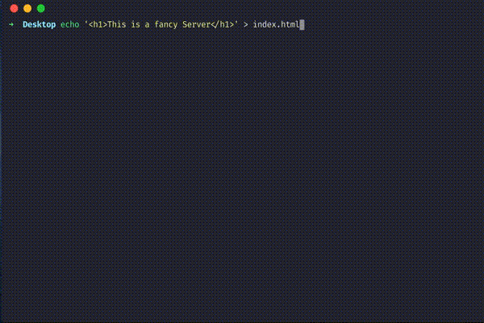

---

title: 'Tip: Run a simple server with Python'
description: ""
pubDate: 2020-05-21
tags: "python, Quick Tips, server"
image: "../images/tip-run-a-simple-server-with-python.jpg"
imgAlt: ""
hideHero: true
---
I used this all the time! When you want to quickly serve a website or a page, or even mock a quick API, you can use python to start a server:

```bash
python -m SimpleHTTPServer
```

This will automatically start a server on port `3000` serving files in the current directory. If you want to change the port, just append the port number at the end: `python -m SimpleHTTPServer 4000`

Using Python3:

```bash 
python3 -m http.server
```

_NOTE: python3 will start in `8000` as the default port._

Even better you can add an alias to your terminal, I use the following:

```bash
alias pserver="python3 -m http.server"
```

You can still adde the port like this: `pserver 4000`.



Enjoy!!
