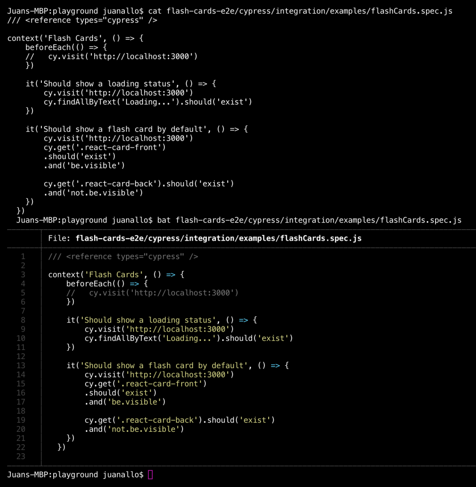

---

title: 'Tip: Syntax Highlighting with BAT'
description: "Terminal command cat is a standard tool to print file contents to the console. I use it all the time but recently I found bat and it changed my life!"
pubDate: 2020-05-07
tags: "coding, development, Homebrew, osx terminal, programming, Quick Tips, tips"
image: "../images/2020-05-cat-vs-bat.png"
imgAlt: "Side to side visual differences between the command cat and bat"
hideHero: true
---

Terminal command `cat` is a standard tool to print file contents to the console. I use it all the time but recently I found `bat` and it changed my life!

`bat` will also print file contents but provides syntax highlighting. If you use Homebrew it is super easy to install:

```bash
brew install bat
```

Here is an example of how the output will look like compared to cat:



Enjoy!!
