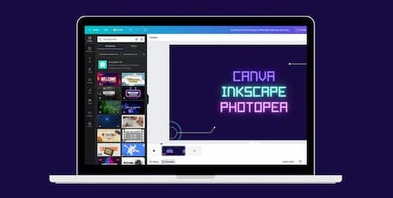
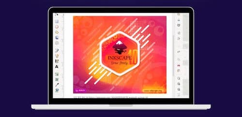
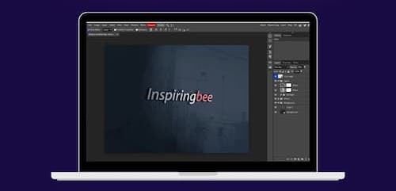

---

title: 'Unlocking Powerful Design: 3 Affordable Alternatives to Big Names'
description: ""
pubDate: 2023-09-08
redirect_from: 
            - http://juanmanuelalloron.com/?p=891
tags: "art, Content Curation, design process, ux, Whatever"
image: "../images/2023-09-canva-1.jpg"
imgAlt: "A notebook showcasing Canva, Photopea and Inkscape"
draft: true
---
We all know the big names and how you can create amazing things using them. But let’s be real, not everyone has the money to spend on these tools. Also these tools usually require some training. So what’s the alternative?

In this post I plan to share with you 3 design tools that have made my life much easier.

## Canva

First of all [Canva](https://www.canva.com/). It is a web-based graphic design platform that allows users to create a wide variety of visual content, including presentations, posters, social media graphics, and more.

Here are some of the benefits:

- **User-Friendly Interface:** Canva offers an intuitive and easy-to-use interface with drag-and-drop functionality, making it accessible for individuals without design experience.
-
- **Templates and Pre-Made Designs:** Canva provides a vast library of professionally designed templates and layouts for various purposes, allowing users to create visually appealing content quickly.
-
- **Customization Options:** Users can personalize templates by easily adjusting colors, fonts, images, and other elements, enabling them to create unique and tailored designs without the need for advanced design skills.
-
- Lots of options are free but if you need to pay for an image the prices are not bad.

I usually use Canva to create the images on this blog.

## Inkscape

Now if you are looking to create vector graphics then you should try out [Inkscape](https://inkscape.org/). It requires some time to get used to the tool and installing it could be painful ([specially on mac](https://inkscape-manuals.readthedocs.io/en/latest/installing-on-mac.html)) but it’s totally worth it.

Here are some of the benefits:

- **Open Source and Free:** Inkscape is freely available for download, making it accessible to users without any cost.
-
- **Vector Graphics:** It supports vector graphics, allowing for the creation of images that can be scaled infinitely without loss of quality, making it ideal for logos, icons, and illustrations.
-
- **Advanced Tools:** Inkscape offers a range of tools and features for design, text manipulation, shapes, and paths, similar to professional design software.
-
- **Cross-Platform:** Inkscape works on multiple operating systems, including Windows, macOS, and Linux, ensuring compatibility and flexibility.
-
- **Community and Resources:** Being open source, Inkscape has an active community, tutorials, and resources available online, which can help users learn and improve their design skills.
-
- **SVG Format:** It primarily uses the Scalable Vector Graphics (SVG) format, which is widely supported on the web and can be easily integrated into websites and digital projects.
-
- **Extensions and Plugins:** Inkscape supports extensions and plugins that can enhance its functionality, allowing users to customize and extend the software's capabilities.
-
- **Non-Destructive Editing:** Inkscape enables users to edit elements without permanently altering the original image, promoting experimentation and creative freedom.
-
- **Suitable for Beginners and Enthusiasts:** Its user-friendly interface makes it approachable for beginners, while its comprehensive features make it valuable for design enthusiasts and professionals.
-
- **File Compatibility:** Inkscape can import and export various file formats, enhancing interoperability with other design software and tools.

I have used Inkscape extensively in the past and it has worked perfectly for me. I often use it to create web icons, web designs and SVGs for animations. For example I used it to create all the designs on the [Drink or dare app](https://play.google.com/store/apps/details?id=com.sesalefuerte.app&hl=en_US&gl=US)

## Photopea

Finally, for a contender to compete with Photoshop there is [photopea.com](https://www.photopea.com/). I have discovered this tool recently and I fall in love with it. No need to look for random online sites to do things like text effects or remove backgrounds, this tool provides a lot of the features Photoshop has.

Here are some specific examples of what Photopea is good for:

- **Editing photos for social media:** Photopea is a great way to quickly and easily edit photos for social media. You can use it to crop, resize, and adjust the brightness and contrast of your photos, as well as add filters and text.
-
- **Creating memes:** Photopea is a great tool for creating memes. You can use it to combine different images and text to create funny or shareable images.
-
- **Designing website graphics:** Photopea can be used to design website graphics, such as buttons, banners, and icons. You can use it to create vector graphics that will look sharp at any size.
-
- **Retouching photos:** Photopea can be used to retouch photos, such as removing blemishes, adjusting skin tone, and whitening teeth.

All of these apps have big communities and content around them and that’s always a big plus. If you need to do something specific there is likely someone that created a tutorial.

Let me know if you liked these tools and what other tools are a must in your toolbox.
