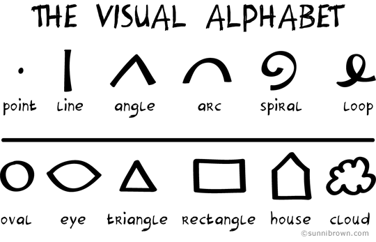
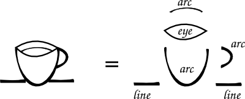

---

title: 'Visual Alphabet'
description: "Sketching and doodling have an important role in UX designer day to day tasks. But a UX guy doesn’t need to be a visual designer, so if you are starting in the UX world don’t be afraid;"
pubDate: 2014-11-10
tags: "doodling, sketching, techniques, ux skills, visual alphabet, Whatever"
image: "../images/2014-11-visual-alphabet.png"
imgAlt: "Visual Alphabet elements"
hideHero: true
---
Sketching and doodling have an important role in UX designer day to day tasks. But a UX guy doesn't need to be a visual designer, so if you are starting in the UX world don't be afraid; you won't be judged based on your drawing capabilities.

On the other hand, we use sketching to convey ideas and communicate messages, but if nobody can understand your drawings, the communication will be hard and delivering the message will be impossible. So, make sure you practice your drawings and learn how to visually interact.

Once more, it is not about creating amazing visual designs, it is about sketching concepts so your audience can understand them, and in order to achieve this you need to practice. In several books and articles you will find this concept of a Visual Alphabet. A set of simple elements that together will help you create any form/object.

Practice with this simple elements to build complex objects, and you will increase your visual communication skill drastically. For example, take a look at this coffee cup, and you will see that drawing it is just a matter of combining the right pieces!

I will recommend to take one word a day do a sketch, and try to polish it until it is clear. You can easily test if the message can be understood by showing your drawing to anyone and ask him what it is. You can use random word generators to get every day word. For example, you can use [the Pictionary word generator](http://www.wordgenerator.net/pictionary-word-generator.php "Pictionary word generator").

If you need to reinforce the message, you can always use words in the sketches. If you are drawing a cat, but it is possible that it can be confused with a horse, reinforce the message with the world cat! It is always good to use information redundancy to make sure the message is acknowledged.

Enjoy!

---

Want to know more?

- [The doodle revolution](http://www.amazon.es/dp/1591845882 "The doodle revolution") written by Sunni Brown
- [Adventures in Experience Design](http://amzn.com/B00H2KEPFC) written by Carolyn Chandler and Anna Van Slee
