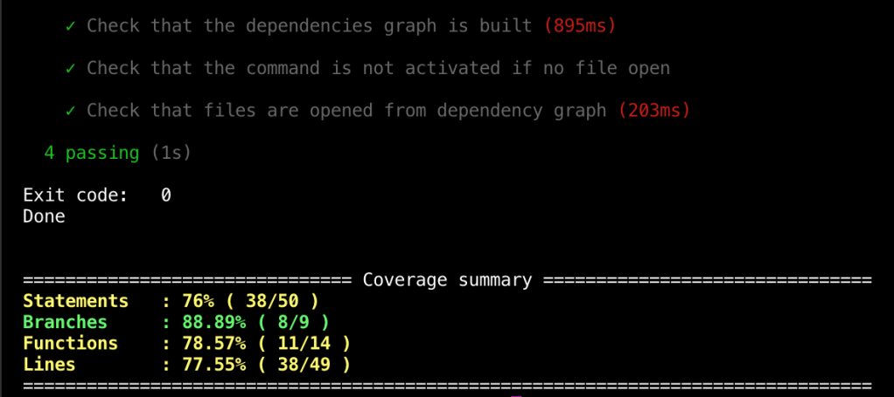
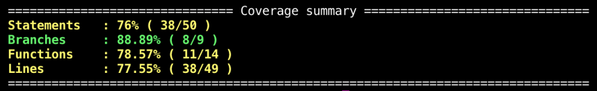
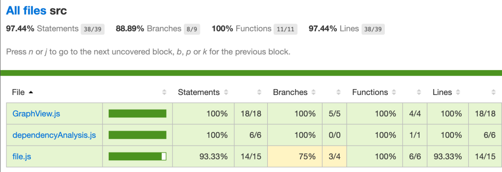
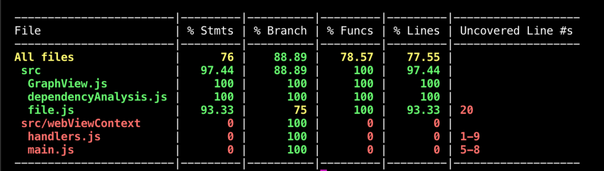

---

title: 'Visual Studio Code Extensions: Adding code coverage in 3 easy steps'
description: ""
pubDate: 2020-04-07
tags: "code coverage, coding, development, extension, istanbul.js, istanbulJs, javascript, Mocha, testing, visual studio code, vs code, vscode, vscode extension, web"
image: "../images/2020-04-coverage-example.png"
imgAlt: "Coverage output example"
hideHero: true
---
In this quick tutorial I will show how you can add test coverage to your vscode plugin repository.

VS code extensions use Mocha as a testing library. Mocha has great integration with [Istanbul.js](https://istanbul.js.org/) and it is super easy to configure it. Here are the steps:

## 1.Install Istanbul CLI

Add NYC (Istanbul CLI package) to your project:

```bash
npm i -D nyc
yarn add -D nyc
```

## 2. Add coverage script

NYC integrates out of the box with Mocha, so adding coverage is as easy as adding a new script to the package.json:

```json
"scripts": {
"test": "node ./test/runTest.js",
"coverage": "nyc npm run test" //or nyc yarn test
},
```

Now when you run: `npm run coverage` or `yarn coverage` NYC will instrument the code, tests will be executed and a report generated. 



## 3. Customize coverage report using configurations

NYC allows a configuration file to customize it. The main options you would want to focus on are: `include`, `exclude`, `reporter`. This 3 will allow to customize what files to include in the report and how it should be generated. For the [full list of options check the Readme](https://github.com/istanbuljs/nyc). Here is an example of a config I use for vscode extensions:

```json
{
"all": true,
"include": ["src/**/*.js"],
"extension": [".js"],
"reporter": ["text", "html"]
}
```

NYC generates some new folders for cache and for reports, so you will need to ignore those in `.gitignore` file:

```bash
.nyc_output/
coverage/
```

### What reporter to use?

I like to use 2 reporters: `["text-summary", "html"]`.

`text-summary` provides a general summary of the coverage numbers:



`html` generates a full report that will let you check coverage file by file:



The `html report` is stored by default in `coverage/index.html`. Keep in mind that the file structure changes between reporters.

If you want a more verbose summary in the terminal, you can use `["text", "html"]`. This will generate a summary in the console too:



You can also check the [full list of supported reporters](https://istanbul.js.org/docs/advanced/alternative-reporters/).

Now you are ready to track your progress writing tests and keep your quality accountable.

Enjoy!!!
