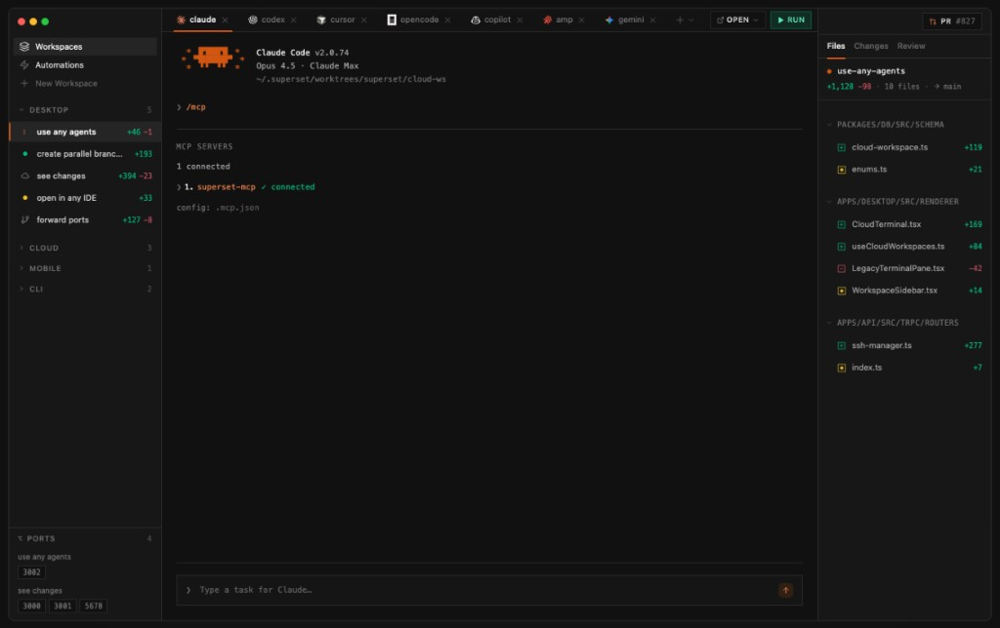

_Orchestration, visibility, and quality gates for agent-heavy workflows_

Once you are running parallel agents, worktrees, and long CLI sessions, the slow part is rarely the model. It is coordination: who is on which branch, what finished, and what still needs a human merge. This digest is tools aimed at that layer: boards, terminals, dashboards, and workflows with opinions.

## 1. Cline Kanban: board view for parallel agents  
**Repo:** [github.com/cline/kanban](https://github.com/cline/kanban)

Kanban style view over parallel agents, with **git worktrees** so terminals are not fighting one checkout. I reach for a board here because parallel agents only help if state is visible at a glance, and most teams already know this metaphor. If Cline is already in your stack, this is the lowest-friction fleet UI to try first.

<video src="/images/weekly-digest-13/cline-kanban-section-01.mp4" controls style="max-width:100%;border-radius:8px;margin:1em 0;" poster="/images/weekly-digest-13/cline-kanban-section-01-poster.jpg">
  Your browser does not support the video tag.
</video>

**Watch (Cline extension, not Kanban-specific):** [Cline: the collaborative AI coder](https://www.youtube.com/watch?v=uIKmG3M0X3M) · [Cline 3.15 update walkthrough](https://www.youtube.com/watch?v=Y5a2VvAMZ28)  
**Read:** [Cline Kanban docs](https://docs.cline.bot/kanban) · [Announcing Kanban (blog)](https://cline.bot/blog/announcing-kanban)

## 2. Superset: run many agents locally  
**Site:** [superset.sh](https://superset.sh/) · **Repo:** [github.com/superset-sh/superset](https://github.com/superset-sh/superset)

macOS editor aimed at **10+ parallel** CLI coding agents, each in its own **git worktree**, with one place to watch diffs and status. Spinning up agents is easy; reading ten diff streams is not—Superset talks about that constraint in the product, not only on the landing page. Benchmark it on a repo you actually use: parallelism pays off when tasks split cleanly by folder or concern.

**Watch:** [Superset multi-agent demo](https://www.youtube.com/watch?v=mk02bSQmEKY)

**Read:** [Parallel coding agents guide](https://superset.sh/blog/parallel-coding-agents-guide) · [Roadmap / scaling thoughts](https://superset.sh/blog/roadmap-to-100-agents)

## 3. The Pair: two agents that cross-check each other  
**Repo:** [github.com/timwuhaotian/the-pair](https://github.com/timwuhaotian/the-pair)

Desktop **dual-agent** setup: one side more mentor/planning/review, the other writes and runs commands, with the goal of catching bad output before it lands. Single-agent chats often skip explicit review; a second agent is a cheap sanity check when wrong code is expensive. I would lean on it for auth, migrations, and concurrency—not boilerplate.

## 4. cmux — terminal agents with vertical tabs  
**Repo:** [github.com/manaflow-ai/cmux](https://github.com/manaflow-ai/cmux)

Native macOS terminal (Ghostty-adjacent) with **vertical tabs**, notification rings when an agent needs input, splits, and hooks for lots of agent panes. A lot of power users want better navigation inside the terminal, not another full GUI. It fits naturally next to tmux-heavy stacks like Agent of Empires or agent-viewer if everyone is on macOS.

**Watch:** [cmux: the terminal built for multitasking](https://www.youtube.com/watch?v=i-WxO5YUTOs)  
**Read:** [cmux site](https://www.cmux.dev/)

## 5. Mission Control: dashboard for agent fleets  
**Repo:** [github.com/builderz-labs/mission-control](https://github.com/builderz-labs/mission-control)

Self-hosted **dashboard** for tasks, agents, logs, tokens, skills, cron, webhooks, and pipelines—SQLite-first, many panels. After more than one non-human thing can touch infra and repos, I want something closer to an ops control plane than a single chat log. Compared with Kanban: boards for workflow stages, dashboards for telemetry and control—some teams want both.

**Read:** [Quickstart](https://github.com/builderz-labs/mission-control/blob/main/docs/quickstart.md) · [CLI agent control](https://github.com/builderz-labs/mission-control/blob/main/docs/cli-agent-control.md)

## 6. Agent of Empires: tmux plus worktrees  
**Site:** [agent-of-empires.com](https://www.agent-of-empires.com/) · **Repo:** [github.com/njbrake/agent-of-empires](https://github.com/njbrake/agent-of-empires)

**tmux** session manager with **git worktree** automation: isolated branches and directories without cloning the whole repo again. Worktrees are still the pattern I trust most to keep agents from stomping the same tree. This is the path I think of when one branch and one pane are not enough anymore.

**Read:** [Git worktrees + AI development](https://agent-of-empires.com/guides/git-worktrees-ai-development/) · [Managing multiple coding agents](https://agent-of-empires.com/guides/manage-ai-coding-agents/)

**Similar workflow (tmux + worktrees + Claude):** [Claude Code + tmux + worktrees](https://www.youtube.com/watch?v=bWKHPelgNgs)

## 7. Maestro: Bloomberg-style terminal for CLI agents  
**Repo:** [github.com/its-maestro-baby/maestro](https://github.com/its-maestro-baby/maestro)

Cross-platform desktop **grid of terminals** with worktrees, git graph, MCP hooks—a dense cockpit for several CLI agents at once. When you are drowning in logs and subprocess output, density usually beats wizard UIs. Try it if Mission Control feels too "web app" and raw tmux feels too bare.

**Watch:** [Maestro — agent orchestration command center (demo)](https://www.youtube.com/watch?v=fmwwTOg7cyA) · [Extensions shorts](https://www.youtube.com/watch?v=e35KYdekjaY)  

## 8. agent-viewer: Kanban for Claude Code in tmux  
**Repo:** [github.com/hallucinogen/agent-viewer](https://github.com/hallucinogen/agent-viewer)

Web **Kanban** on top of **Claude Code** sessions in **tmux**: spawn, watch output, send messages—visibility for fleets. Standups and pairing go smoother with a shared surface that is not "SSH in and guess the pane." If you standardized on Claude Code + tmux, this is one of the more direct visibility upgrades.

## 9. AionUi: unified UI for multiple CLI agents  
**Repo:** [github.com/iOfficeAI/AionUi](https://github.com/iOfficeAI/AionUi)

**Unified desktop UI** wrapping several CLI agents to cut hopping between terminals and sites. Consolidation only works if keyboard flow stays tight and the UI is honest about each backend's limits. Judge it on latency and shortcuts—a sluggish tab strip loses to six iTerm windows.

## 10. OpenAI Symphony: isolated autonomous implementation runs  
**Repo:** [github.com/openai/symphony](https://github.com/openai/symphony)

Frames work as **isolated, autonomous runs** with structured handoffs—teams steer outcomes and work packages instead of babysitting every line. It is OpenAI's take on what a serious multi-agent SDLC might look like: units of work, traces, gates. Pair it with whatever review and test policy you already use; autonomy without traceability does not survive production.

**Watch:** [Multi-agent code explained (OpenAI)](https://www.youtube.com/watch?v=pAumzZ5NxvE)

**Read:** [Symphony on GitHub](https://github.com/openai/symphony)

## 11. Warp: terminal built for agents and teams  
**Repo:** [github.com/warpdotdev/warp](https://github.com/warpdotdev/warp)

**GPU-accelerated** terminal with blocks, workspaces, sharing, and **built-in AI** so normal shell work and agent-assisted commands share one surface. A chunk of "fleet" pain is still terminal UX: reusable commands, blocks, errors you can point the model at inline. Warp optimizes the terminal you live in every day; cmux and Maestro skew toward orchestrating many agent sessions—they overlap some, but they are not the same job.

**Watch:** [Warp + AI coding walkthrough](https://www.youtube.com/watch?v=RwJhoWm0Aas) · [AI in the terminal](https://www.youtube.com/watch?v=hETUdeBQqkI) · [Feature highlights](https://www.youtube.com/watch?v=HSgHiRxsFzg)  

**Read:** [Warp docs](https://docs.warp.dev/)

## Final take

None of this replaces clear task splits, tests, or human review. It chips away at the coordination tax when you run more than one agent. Practical defaults from this list: **worktrees + tmux** (Agent of Empires, cmux, agent-viewer) for isolation and navigation; **Kanban or Mission Control** when the team needs a shared picture; **The Pair** when quality matters more than raw parallelism; **Symphony** if you want to study how a vendor frames multi-agent workflow; **Warp** if you want one strong terminal as home base for those shells.
