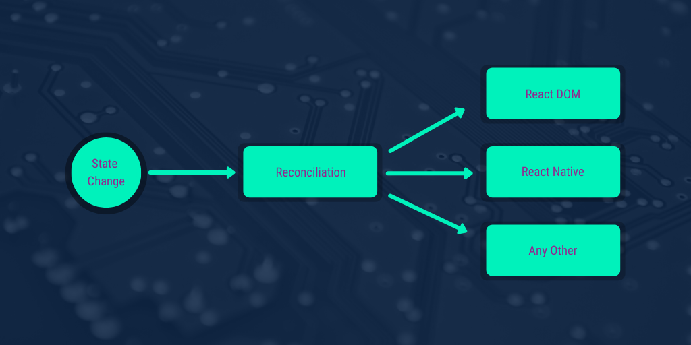

---

title: 'Weekly Digest #4: On React internals'
description: ""
pubDate: 2020-04-12
tags: "digest, howitworks, internals, javascript, React, React Fiber, web, Weekly Digest"
image: "../images/2020-04-state-change.png"
imgAlt: "React Process that involves figuring out differences between DOM and vDOM"
hideHero: true
---
This weekly digest focuses on React internals. Understanding how react works internally helps to follow best practices when coding, better understanding on performance and extra skills to debug those hard bugs. React defines that UI is a function of state: `UI = f(s)` . Every time the state changes react calculates the new UI (reconciliation) and renders the differences:

Read the following sources to understand better how the whole process works:

- [Notes on React Internals](https://github.com/izaakrogan/react-internals): **TL;DR** **version**. Read this summary if you want to learn more about react but are not 100% on the mood to read a bunch of articles or posts.
- [React Internals Presentation](https://www.slideshare.net/AnkitMuchhala/react-internals-how-understanding-react-implementation-can-help-us-write-better-code): A high level presentation that explains in slides all the concepts in the next bullets. I recommend to read this one first, and also last.
- [React Design Principles](https://reactjs.org/docs/design-principles.html): What principles was React defined on. It provides insight on why and how certain decisions were made. Learning the principles first will lead to the “aha” moment when digging into the internals.
- [React Components, Elements and Instances:](https://reactjs.org/blog/2015/12/18/react-components-elements-and-instances.html) Understanding the difference between components, elements and instances. This section also introduces reconciliation.
- [Reconciliation](https://reactjs.org/docs/reconciliation.html): How react understands the impact a change in state has on the UI. This step allows react to be optimal on what to update. This process it is also known as Virtual DOM diffing.
- Now Let’s focus on ReactDOM. Learn everything about React DOM from [this tutorial](http://www.mattgreer.org/articles/react-internals-part-one-basic-rendering/). 5 posts that will give you the possibility to code your mini version of React.
- On React 16 the whole reconciliation algorithm was redesigned and Fiber was born. Get a high level view of [how Fiber works](https://github.com/acdlite/react-fiber-architecture) and then [deep dive into the specifics](https://blog.logrocket.com/deep-dive-into-react-fiber-internals/). Or if you don’t feel like reading anymore, check [Lin Clark - A Cartoon Intro to Fiber - React Conf 2017 video](https://www.youtube.com/watch?v=ZCuYPiUIONs).
- Saw a concept like memoized or algebraic effects and you want to learn more? Start in this [React Basic Github Readme](https://github.com/reactjs/react-basic). Also, you can check [Exploring React JS Internals](https://mohandere.github.io/react/react-internals/) post that links to more concepts on React internals (purity, composition, side effects, lazy evaluation, Higher order functions, immutability, currying, memoization and more!)
- If you reached here, you deserve a price! Check [this GitHub repository](https://github.com/enaqx/awesome-react) with a comprehensive list of everything React.

Enjoy!!!
