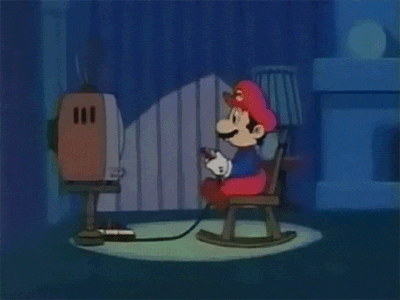

---

title: 'Weekly Digest #8: On building games'
description: ""
pubDate: 2020-05-10
tags: "development, gameDev, javascript, js, unity, Weekly Digest, Whatever"
image: "../images/weekly-digest-8-on-building-games.jpg"
imgAlt: ""
---
It has been always in the back of my head to develop some games. A while back I developed an android game called [Drink or Dare](https://play.google.com/store/apps/details?id=com.sesalefuerte.app&hl=en_US) with some friends, but that's about it.

Today, I want to share a list of resources I have been bookmarking to help me develop games.

[via giphy](https://giphy.com/gifs/video-games-nintendo-mario-aX0RqLt2ARSW4/)

- [Learn JavaScript by building 7 games](https://www.freecodecamp.org/news/learn-javascript-by-building-7-games-video-course/). If you are just getting started with JS, check this video tutorial. You will build multiple small games like a memory game, snake, space invaders and even a Tetris! All by using vanilla JS.
- The above game tutorial was created by Ania Kubow. If you liked those, she has more in her [youtube series](https://www.youtube.com/watch?v=kSt2_YZzCec&list=PLRD1Niz0lz1uR4W3ms6DygWMjXW-6hDB_) or in her [Github](https://github.com/kubowania?tab=repositories).
- Check out this [video](https://www.youtube.com/watch?v=3EMxBkqC4z0) with an intro to game development using JS and Canvas. The game you will create is the famous brick-breaker!
- Looking for more JS engines I found this article: [9 Top JS Gaming Engines and Libraries for 2020](https://blog.bitsrc.io/9-top-js-gaming-engines-and-libraries-for-2020-81707d9f095). Another engine I found browsing around is [Crafty.js](http://craftyjs.com/).
- From one of those 9 engines, here is an [article](https://blog.bitsrc.io/writing-a-typing-game-with-melonjs-ef0dd42f37bf) explaining how to use [MelonJS](http://www.melonjs.org/) to develop a game.
- Want to try create some games using React? Check [Building an HTML5 game with React and socket.io](http://janekk.github.io/2015/03/12/building-html5-game-react-socketio.html)
- If you are looking for a low coding option to create 2D games, then checkout [Stencyl](http://www.stencyl.com/).
- Going more pro, check [Unity Create with Code Live free course](https://learn.unity.com/course/create-with-code-live). This one is in C#, but Unity is a really powerful game engine and the course has an intro to C#. Ready to learn a new programming language?
- [GODOT engine](https://godotengine.org/) is another open source option to develop games (both 2D and 3D). It looks like a more comprehensive platform, but it will probably have a longer learning curve.

Can't wait to see what you create. 
