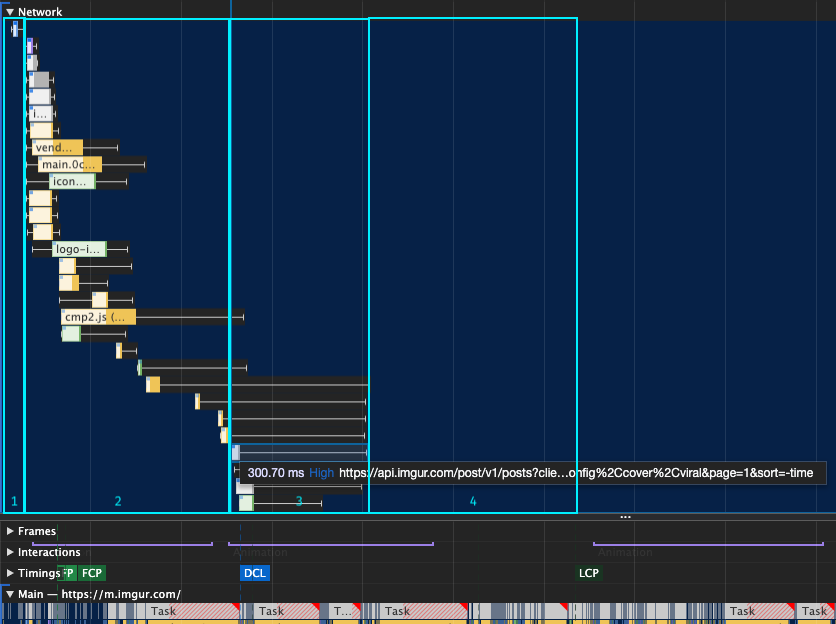

---

title: 'What''s all the hype about React Server Components?'
description: ""
pubDate: 2021-01-07
tags: "development, javascript, js, performance, React, react server components, ssr"
image: "../images/2020-12-imgur-loading-sequence.png"
imgAlt: "A typical loading sequence for a web page" 
---
A couple of weeks ago the React team announced React Server Components. In this article today I will explain what it is, why they came up with this strategy and how to get prepared for it.

## What're React Server Components?

TL;DR: React Server Components is a new experimental feature by the React team to support progressive hydration by allowing component to be rendered exclusively on the server, client or both.

By splitting the component tree between Server and client the amount of JS that needs to be loaded in the client can be reduced and also latency to fetch data could be improved (by running part of it on the server). This should improve the loading experience a tenfold (Or at least to numbers that are hardly achievable with React these days)

You should check the [official demo from the React team](https://reactjs.org/blog/2020/12/21/data-fetching-with-react-server-components.html) and [read the RFC](https://github.com/reactjs/rfcs/blob/bf51f8755ddb38d92e23ad415fc4e3c02b95b331/text/0000-server-components.md) to learn more about them. There are also 2 other articles I recommend to get different perspectives:

- [An Annotated Guide to React Server Components](https://www.swyx.io/react-server-components-demo/)
- [React Server Component from Addy Osmani](https://addyosmani.com/blog/react-server-components/)

## What is trying to solve?

TL;DR: Performance!

There are 2 main performance bottlenecks in today's JS based websites/apps:

- The resources footprint to be able to serve and make a page interactive is usually high. Any JS, CSS and images that the page needs to download will impact loading performance. A healthy budget should be 250 kb or less (and [just React, reat-dom and apollo-client can get you close to the budget](https://bundlephobia.com/scan-results?packages=react@17.0.1,react-dom@17.0.1,apollo-client@2.6.10,apollo-cache-inmemory@1.6.6)!)

- The latency and roundtrips to fetch data and render it also depends on the conditions the user is in when browsing. Even with the optimal conditions you have a waterfall sequence to load a page:

  1. Page request, serve initial HTML (mostly empty unless who have traditional SSR in place)
  2. Load all the assets from server/CDN. This includes JS, CSS, Images, etc
  3. Parse and execute the JS.
  4. Make an API request to fetch the data
  5. Render the data

Let's see this in more detail with an example:

I took Imgur as an as an example for illustrating this common problem, but most of the websites using react will have a similar loading pattern. For the example I am loading <https://imgur.com/> and running a performance trace.

Loading sequence

In the loading sequence we can see that there are empty frames. These reflect the time the critical resources (JS, CSS, images, etc) took to download + the roundtrip for the main API call. We can see that in more detail below:

Performance trace showing initial loading sequence

The Performance trace above shows the common loading pattern in React Applications:

1. Get Initial Request from Server. If traditional SSR is used then this will result in longer time for the server to return the request
2. Load critical Assets (JS). We need to load all the JS before starting to fetch content and render.
3. Make the main API calls. Depending on the amount of JS downloaded this call(s) can be deferred quite a bit
4. Render the results. Depending on how much content is needed this could be costly.

To solve this problem we need to 1) reduce the amount of resources we need to download upfront 2) Make the API calls ASAP and reduce the roundtrip as much as possible. There are multiple ways to tackle this problems but Server Components could simplify and empower lots of these strategies.

## Why not just regular SSR?

Regular [SSR](https://reactjs.org/docs/react-dom-server.html) is a good alternative to scale how to build SPA apps. It can help reduce the latency to fetch data from APIs (as both run on the server). It can also help scale rendering as it does not depend on the browser features and device conditions.

The downside of SSR is that it requires a balance and it is hard to get it right. If we automatically decide to fetch and render the whole app in the server, then the [Time ](https://web.dev/time-to-first-byte/)[T](https://web.dev/time-to-first-byte/)[o First Byte](https://web.dev/time-to-first-byte/) (TTFB) will increase and loading performance would not change that much. Users will instead be seeing a blank screen longer until the whole app is loaded.

This can be balanced by hand picking which data to fetch and render in the server and which data in the client but it becomes more challenging to get it right. It could also affect your [cumulative layout Shift ](https://web.dev/cls/)(CLS) and we all know that users hate to see the content flickering while they are trying to read or click on something.

Finally, traditional SSR still requires the whole React tree to be hydrated in the client. In this process React re-builds the "virtual" tree and compares that to the rendered tree, makes sure everything looks correct and adds listeners to make it interactive. There are 2 main downsides of this process:

- Hydration can be costly and differences on server & client trees can cause unexpected bugs.
- The JS needed in the client does not change. Without doing any advanced optimization to enable some progressive hydration you still need the same JS resulting in poor [Time To Interactive](https://web.dev/tti/) (TTI) numbers.

Here is an article from Addy Osmani that explains [the cost of client-side rehydration](https://addyosmani.com/blog/rehydration/) in more detail.

## Why not just [JAMStac](https://jamstack.org/)[k](https://jamstack.org/)?

Going into a more offline/deploy-time rendering strategy and serving static content is a perfectively valid strategy that can take you there but it won't cover all the scenarios in the spectrum. Highly interactive sites won't be able to execute this strategy as easy as other more static sites like blogs.

In the end Server Components could even help this strategy further, as it provides more flexibility to define how granular the interactive pieces of a page should be.

## What can I do to get prepared?

Server components are not there yet and if we take past examples like suspense to estimate when it could become generally available then we should probably be prepared for not seeing this widely adopted in 2021.

In any case here are some steps you can take today to align with the Server components strategy:

- Play with the demos and get a good sense of how you could leverage it. Any webapp will be different so you should explore and experiment to see how much it could benefit your use case. Check these demos to get you started:

  - [Official Demo from the React team](https://github.com/reactjs/server-components-demo)
  - [Fork without Postgres dependency](https://github.com/pomber/server-components-demo)
  - [React Server components running on AWS ](https://github.com/sw-yx/amplify-react-serverless-components/)(Serverless Lambda function and Amplify)

- If you are not doing any SSR, consider start to experiment with it. It could be a great exercise to identify what components are server/client or both.

- Streaming is going to be a good part of enabling this magic. Depending on your infrastructure you might need to make some changes to enable that. Check this [repository on how to leverage streaming today.](https://github.com/aickin/react-dom-stream) Here is another article on [everything you need to know about node streams](https://www.freecodecamp.org/news/node-js-streams-everything-you-need-to-know-c9141306be93/).

- I will continue to explore other steps to get us closer to the concept and facilitate an easy transition, so stay tuned for more articles!